# **Getting Started**

## **1\. Overview**

In this module you will practice creating, testing and deploying a flow in CDF PC. You will learn to:

* Develop flows using the low-code Flow Designer.  
* Create a test session and interactively test a flow.  
* Version-control a flow into the DataFlow Catalog.  
* Deploy a flow on an auto-scaling production cluster on k8s.

You'll also learn flow design best practices like:

* Create self-contained flow within a Process Group  
* Parameterize flows for reusability  
* Set meaningful names for flow components, including queues (inplace of Success, Fail, and Retry). These names will be used to define Key Performance Indicators in CDF-PC.

The following is a step by step guide in building a data flow for use within CDF-PC.

## **2\. Create a schema in Schema Registry**

1. Login to Schema Registry by clicking the appropriate hyperlink in the Streams Messaging Datahub.

<p align="center">
  
</p>
1. Click on the \+ button on the top right to create a new schema.  
2. Create a new schema with the following information:  
   **Note**: The name of the schema ("syslog") must match the name of the Kafka topic you will create later.  

* Name: **`<userid>-syslog-avro`**

* Description: **syslog schema for dataflow workshop**

* Type: **Avro schema provider**  
* Schema Group: **Kafka**  
* Compatibility: **Backward**  
* Evolve: **True**  
* Schema Text:

```json
{
    "name": "syslog",
    "type": "record",
    "namespace": "com.cloudera",
    "fields": [
      { "name": "priority", "type": "int" },
      { "name": "severity", "type": "int" },
      { "name": "facility", "type": "int" },
      { "name": "version", "type": "int" },
      { "name": "timestamp", "type": "long" },
      { "name": "hostname", "type": "string" },
      { "name": "body", "type": "string" },
      { "name": "appName", "type": "string" },
      { "name": "procid", "type": "string" },
      { "name": "messageid", "type": "string" },
      { "name": "structuredData",
        "type": {
          "name": "structuredData",
          "type": "record",
          "fields": [
            { "name": "SDID",
              "type": {
                "name": "SDID",
                "type": "record",
                "fields": [
                  { "name": "eventId", "type": "string" },
                  { "name": "eventSource", "type": "string" },
                  { "name": "iut", "type": "string" }
                ]
              }
            }
          ]
        }
      }
    ]
}
```


## **3\. Design the flow in the Flow Designer**

### **3.1 Create a new flow** 

1. In Cloudera DataFlow, open the Flow Designer and create a new flow called **\<userid\>-syslog-kafka-flow**  

<p align="center">
  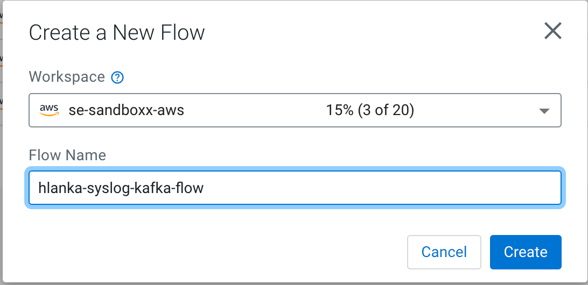
</p>
   

### **3.2 Configure parameters for the flow** 

*Parameters are created within Parameter Contexts. In the context of CDP Flow Designer, one default Parameter Context is auto-created when you create a new draft flow.* 

*You can then add parameters to this one Context, you cannot create additional ones.* 

*This default context is automatically bound to each Process Group you create within your draft Flow, making all parameters available to be used in any process group.*

1. To create a Parameter, click on Flow Options in the top right corner and select Parameters  


<p align="center">
  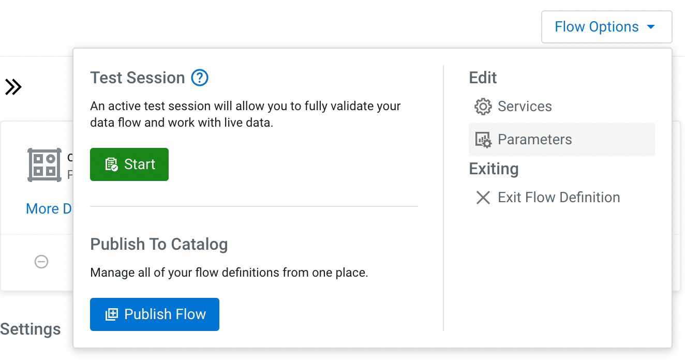
</p>

2. Add the parameters. Click on **Add Parameter \> Add Parameter** for each parameter to be added and enter the appropriate details:

| Name                      | Description                                 | Value                                         |
|---------------------------|---------------------------------------------|-----------------------------------------------|
| CDP Workload User         | CDP Workload User                           | `<your own workload user name>`               |
| Filter Rule               | Filter Rule                                 | `SELECT * FROM FLOWFILE`                      |
| Kafka Broker Endpoint     | Comma-separated list of Kafka Broker addresses | `<comma-separated list of Kafka Broker addresses>` |
| Kafka Destination Avro Topic | Kafka Avro topic name                    | `<userid>-syslog-avro`                        |
| Kafka Destination JSON Topic | Kafka JSON topic name                    | `<userid>-syslog-json`                        |
| Kafka Producer ID         | Kafka Producer ID                           | `<userid>-producer`                           |
| Schema Name               | Schema name                                 | `<userid>-syslog-avro`                        |
| Schema Registry Hostname  | Hostname of Schema Registry service         | `<hostname of Schema Registry service>`       |


* **Kafka Broker Endpoint:** The Kafka brokers' addresses can be found in the Brokers page of the SMM UI. To get there, find your Streams Messaging DataHub and click on the Streams Messaging Manager (SMM) link . On the SMM UI, click on the Brokers icon.  The address of each broker will be shown in this page and consists of the broker host name and port number, as shown below.
<p align="center">
  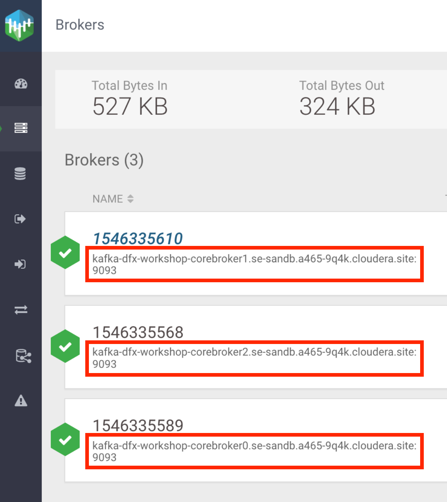
</p>
    

  The value for the Kafka Broker Endpoint parameter must be a comma-separated list of the broker addresses, as shown in the example below:  
<p align="center">
  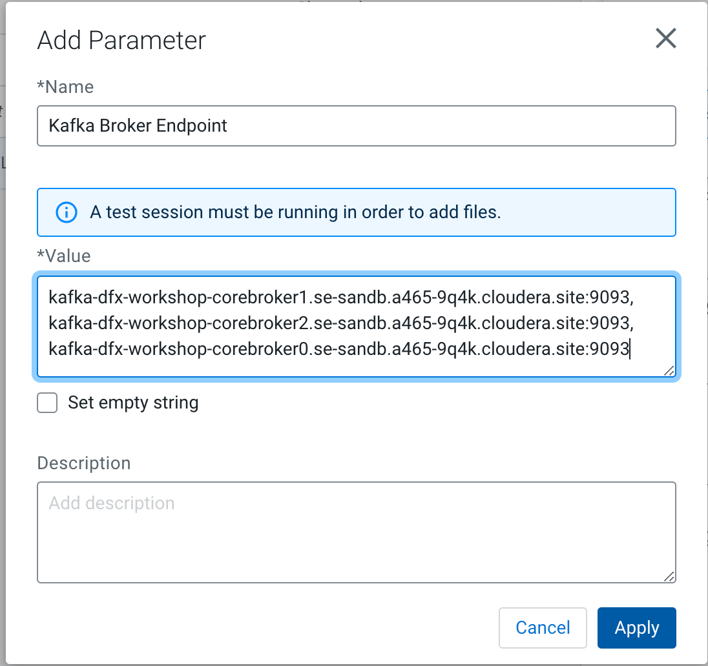
</p>
    
* **Schema Registry Hostname**: to identify the name of the Schema Registry host using Cloudera Manager: on the Streams Messaging DataHub page, click on **CM-UI \> Clusters \> schemaregistry \> Instances** and copy the host name from there:  

<p align="center">
  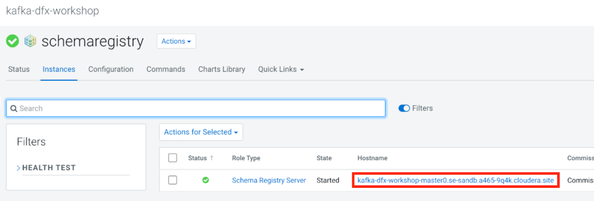
</p>

1. Add the *sensitive* parameters. Click on **Add Parameter \> Add Sensitive Parameter** for each parameter to be added and enter the appropriate details:

| Name | Description | Value |
| :---- | :---- | :---- |
| CDP Workload User Password | CDP Workload User Password | <Your own workload password for the environment\> |

   

4. Once all the parameters have been created verify with the list below
<p align="center">
  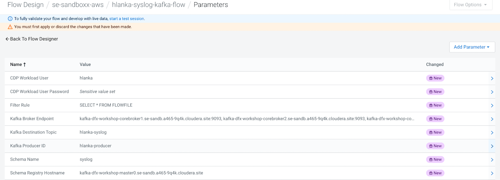
</p>


1. Click **Apply Changes** and then **Back To Flow Designer** to go back to the Flow Designer main page**.**


### **3.3 Create Controller Services** 

*Controller Services are extension points that provide information for use by other components (such as processors or other controller services). The idea is that, rather than configure this information in every processor that might need it, the controller service provides it for any processor to use as needed.*

### **3.3 Create Controller Services**

1. **Enable the Test Session before configuring the services**
      - Select **Flow Options > Test Session**. Use the latest NiFi version (default).
      - Click **Start Test Session**. Test session status changes to Initializing Test Session…
      - Wait for the status to change to **Active Test Session**.
   - *You are not yet at the point of testing the flow, butEnabling a test session forces the Default NiFi SSL Context Service controller service to be created, which you will need in the next steps.*
   <p align="center">
     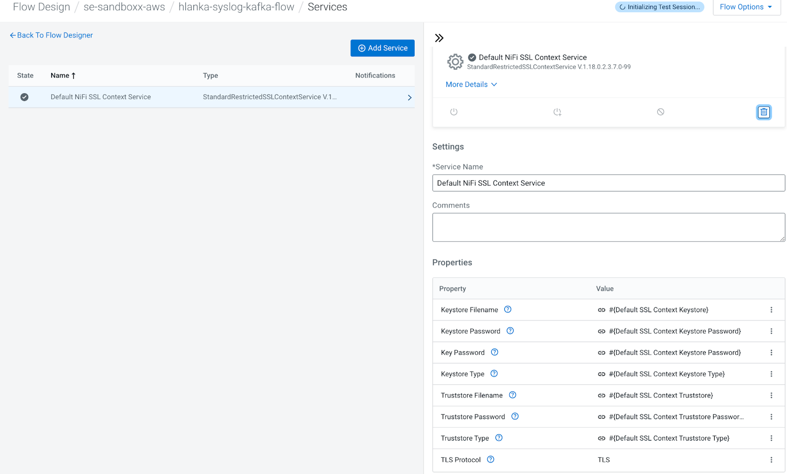
   </p>

2. **Click Flow Options > Services**
   <p align="center">
     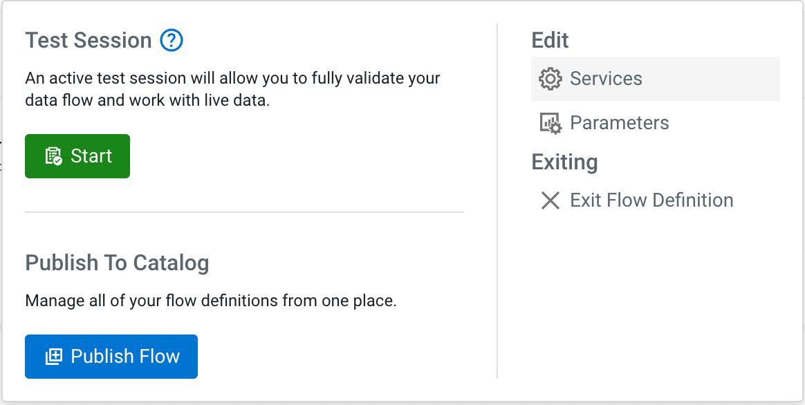
   </p>

3. **Add a new HortonworksSchemaRegistry controller service**
   - Click **Add Service**. The **Add Service** page opens.
     <p align="center">
       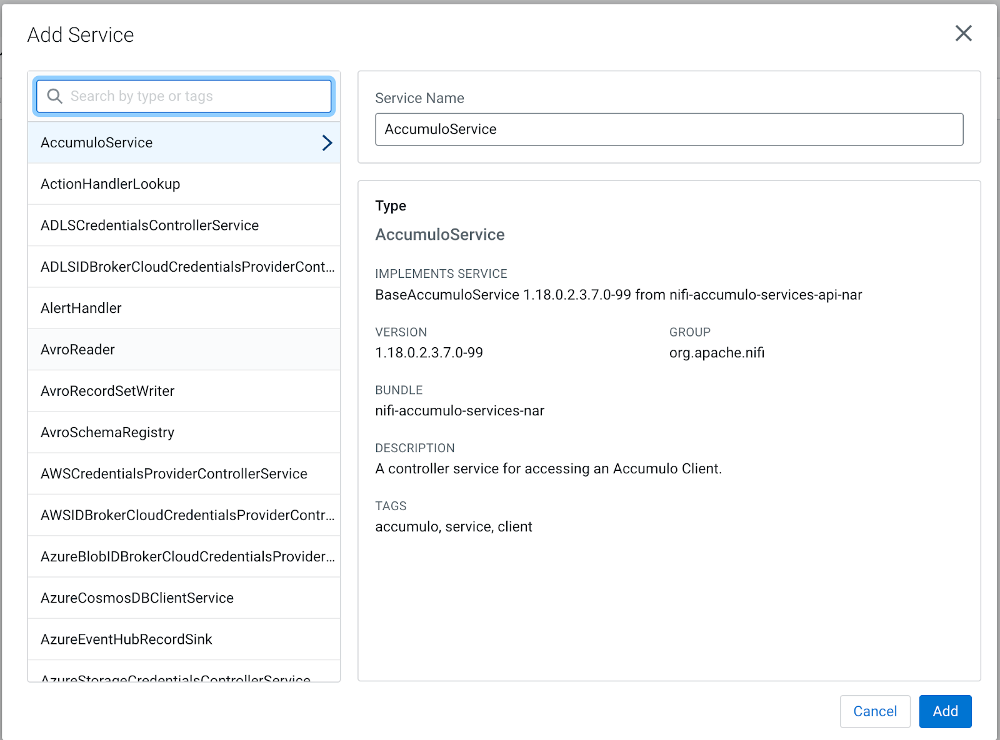
     </p>
   - In the text box, filter for **HortonworksSchemaRegistry**, select it and click **Add**.
   - Configure the HortonworksSchemaRegistry service:
     <p align="center">
       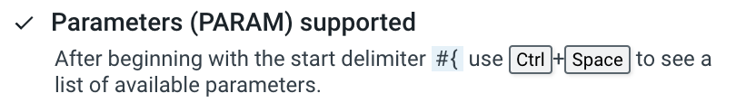
     </p>
     - Service Name: **WS_CDP_Schema_Registry**
     - Properties:
         - Schema Registry URL: `https://#{Schema Registry Hostname}:7790/api/v1`
         - SSL Context Service: **Default NiFi SSL Context Service**
         - Kerberos Principal: `#{CDP Workload User}`
         - Kerberos Password: `#{CDP Workload User Password}`
     <p align="center">
       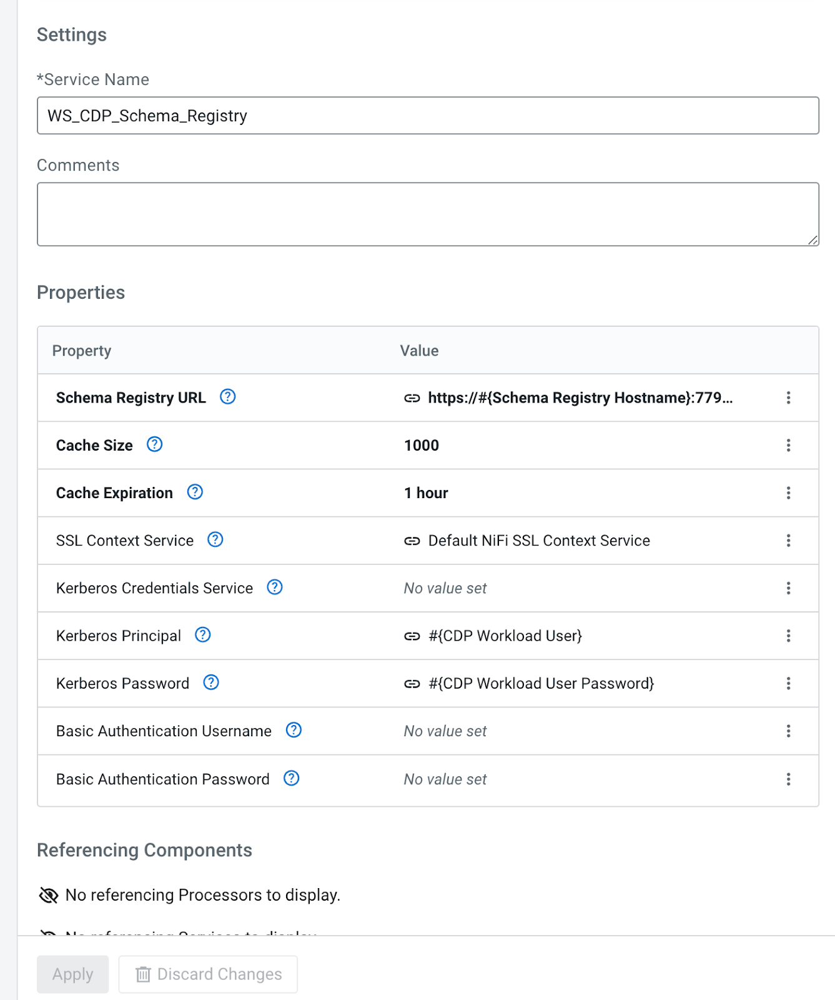
     </p>
   - Click **Apply**
   - Activate the service by clicking on the **Enable** icon
     <p align="center">
       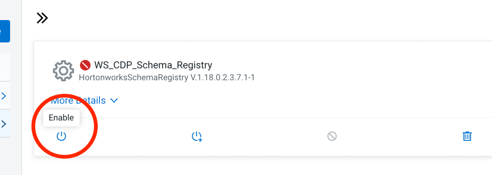
     </p>

4. Add a new **Syslog5424Reader** controller service  
   <ol type="a">
     <li>Click <strong>Add Service</strong>. The <strong>Add Service</strong> page opens.</li>
     <li>In the text box, filter for <strong>Syslog5424Reader</strong>, select it and click <strong>Add</strong></li>
     <li>Configure the Syslog5424Reader service:
       <ol type="i">
         <li>Service Name: <strong>WS_Syslog_5424_Reader</strong></li>
       </ol>
     </li>
     <li>Click <strong>Apply</strong></li>
     <li>Activate the service by clicking on the <strong>Enable</strong> icon</li>
   </ol>

5. Add a new **JsonTreeReader** controller service  
   <ol type="a">
     <li>Click <strong>Add Service</strong>. The <strong>Add Service</strong> page opens.</li>
     <li>In the text box, filter for <strong>JsonTreeReader</strong>, select it and click <strong>Add</strong></li>
     <li>Configure the JsonTreeReader service:
       <ol type="i">
         <li>Service Name: <strong>WS_JSON_Syslog_Reader</strong></li>
         <li>Properties:
           <ol>
             <li>Schema Access Strategy: <strong>Use 'Schema Name' Property</strong></li>
             <li>Schema Registry: <strong>WS_CDP_Schema_Registry</strong></li>
             <li>Schema Name: <strong>#{Schema Name}</strong></li>
           </ol>
         </li>
       </ol>
     </li>
     <li>Click <strong>Apply</strong></li>
     <li>Activate the service by clicking on the <strong>Enable</strong> icon</li>
   </ol>

6. Add a new **JsonRecordSetWriter** controller service  
   <ol type="a">
     <li>Click <strong>Add Service</strong>. The <strong>Add Service</strong> page opens.</li>
     <li>In the text box, filter for <strong>JsonRecordSetWriter</strong>, select it and click <strong>Add</strong></li>
     <li>Configure the JsonRecordSetWriter service:
       <ol type="i">
         <li>Service Name: <strong>WS_JSON_Syslog_Writer</strong></li>
         <li>Properties:
           <ol>
             <li>Schema Access Strategy: <strong>Use 'Schema Name' Property</strong></li>
             <li>Schema Registry: <strong>WS_CDP_Schema_Registry</strong></li>
             <li>Schema Name: <strong>#{Schema Name}</strong></li>
           </ol>
         </li>
       </ol>
     </li>
     <li>Click <strong>Apply</strong></li>
     <li>Activate the service by clicking on the <strong>Enable</strong> icon</li>
   </ol>

7. Add a new **AvroRecordSetWriter** controller service  
   <ol type="a">
     <li>Click <strong>Add Service</strong>. The <strong>Add Service</strong> page opens.</li>
     <li>In the text box, filter for <strong>AvroRecordSetWriter</strong>, select it and click <strong>Add</strong></li>
     <li>Configure the AvroRecordSetWriter service:
       <ol type="i">
         <li>Service Name: <strong>WS_Avro_Syslog_Writer</strong></li>
         <li>Properties:
           <ol>
             <li>Schema Write Strategy: <strong>HWX Content-Encoded Schema Reference</strong></li>
             <li>Schema Access Strategy: <strong>Use 'Schema Name' Property</strong></li>
             <li>Schema Registry: <strong>WS_CDP_Schema_Registry</strong></li>
             <li>Schema Name: <strong>#{Schema Name}</strong></li>
           </ol>
         </li>
       </ol>
     </li>
     <li>Click <strong>Apply</strong></li>
     <li>Activate the service by clicking on the
    </ol>


8. This completes the configuration of all the controller services. Please verify with the list below:  
   <p align="center">
     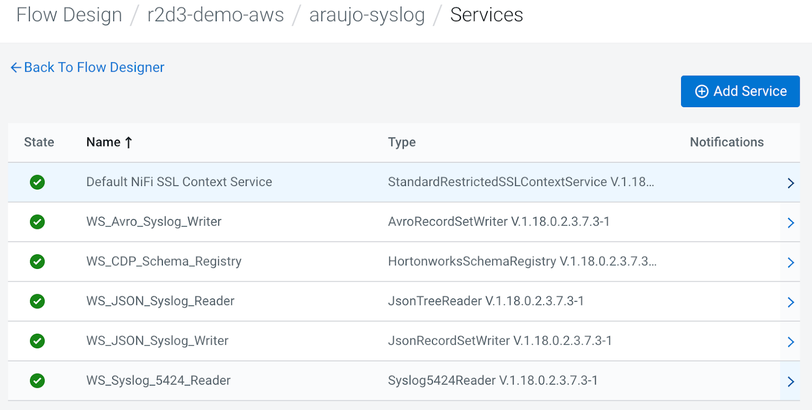
   </p>

9. Click on the **Back to Flow Designer** link to go back to the flow canvas.


### **3.4 Design the flow**

1. Open the Flow Design page  

2. Create the **Generate Syslog RFC5424** processor  

   1. Drag the Processor icon onto the canvas  

   <p align="center">
     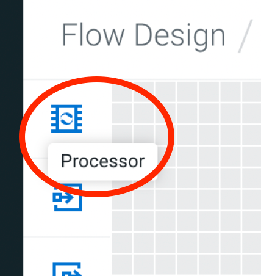
   </p>

   1. Select the **ExecuteScript** processor.  
   2. Configure the processor as follows:  
      1. Processor Name: **Generate Syslog RFC5424**  
      2. Concurrent Tasks: **4**  
      3. Run Schedule: **1 sec**  
      4. Execution: **Primary Node**

        <p align="center">
          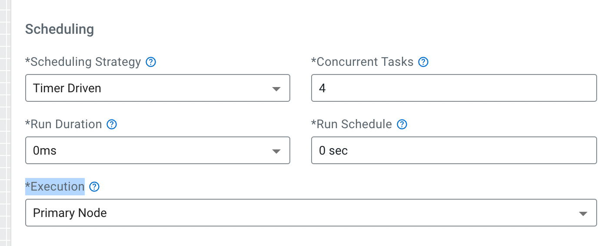
        </p>


        <p align="center">
          
        </p>


      5. Properties:  
         1. Script Engine: **python**  
         2. Script Body: <copy and paste the following script\>

```json
##
## Author: Nasheb Ismaily
## Description: Generates a random RFC5424 format syslog message
##
from org.apache.commons.io import IOUtils
from java.nio.charset import StandardCharsets
from org.apache.nifi.processor.io import OutputStreamCallback
import random
from datetime import datetime

class PyOutputStreamCallback(OutputStreamCallback):
    def __init__(self):
        pass
    def process(self, outputStream):
        hostname = "host"
        domain_name = ".example.com"
        tag = ["kernel", "python", "application"]
        version = "1"
        nouns = "application"
        verbs = ("started", "stopped", "exited", "completed")
        adv = ("successfully", "unexpectedly", "cleanly", "gracefully")
        for i in range(1,10):
            application = "{0}{1}".format(nouns, random.choice(range(1, 11)))
            message_id = "ID{0}".format(random.choice(range(1, 50)))
            random_tag = random.choice(tag)
            structured_data = "[SDID iut=\"{0}\" eventSource=\"{1}\" eventId=\"{2}\"]".format(random.choice(range(1, 10)), random_tag, random.choice(range(1, 100)))
            time_output = datetime.utcnow().strftime('%Y-%m-%dT%H:%M:%S.%f')[:-3] + 'Z'
            random_host = random.choice(range(1, 11))
            fqdn = "{0}{1}{2}".format(hostname, random_host, domain_name)
            random_pid = random.choice(range(500, 9999))
            priority = random.choice(range(0, 191))
            num = random.randrange(0, 4)
            random_message = application + ' has ' + verbs[num] + ' ' + adv[num]
            syslog_output = ("<{0}>{1} {2} {3} {4} {5} {6} {7} {8}\n".format(priority, version, time_output, fqdn, application,random_pid, message_id,structured_data, random_message))
            outputStream.write(bytearray(syslog_output.encode('utf-8')))

flowFile = session.create()
if (flowFile != None):
    flowFile = session.write(flowFile, PyOutputStreamCallback())
    session.transfer(flowFile, REL_SUCCESS)


```


   6. Relationships: check **Terminate** for the **failure** relationship  
    <p align="center">
    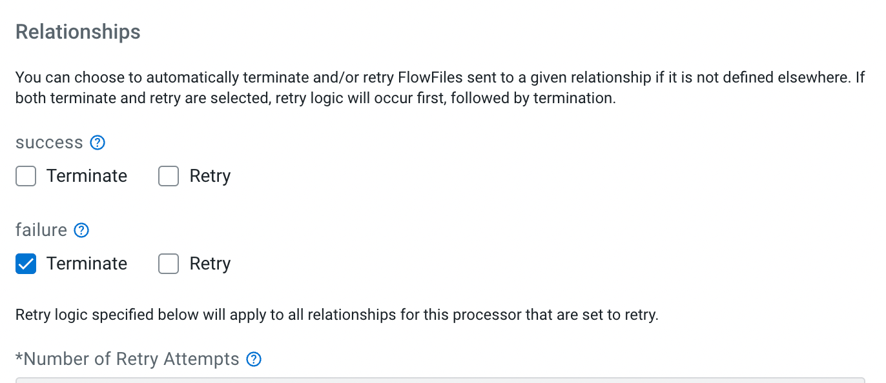
    </p>

   4. Click **Apply**  
        
    <p align="center">
    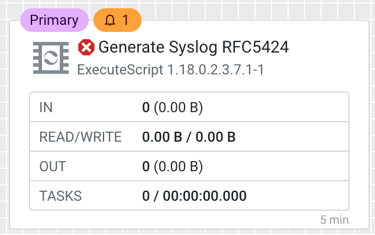
    </p>

3. Create the **Filter Events** processor  
     
   1. Drag the Processor icon onto the canvas  
   2. Select the **QueryRecord** processor.  
   3. Configure the processor as follows:  
      1. Processor Name: **Filter Events**  
      2. Properties:  
         1. Record Reader: **WS\_Syslog\_5424\_Reader**  
         2. Record Writer: **WS\_JSON\_Syslog\_Writer**  
      3. Click on the **Add Property** button to add a new property:  
         1. Property Name: **filtered\_event**  
         2. Property Value: **\#{Filter Rule}**  
      4. Relationships: check **Terminate** for the **failure** and **original** relationships  
            <p align="center">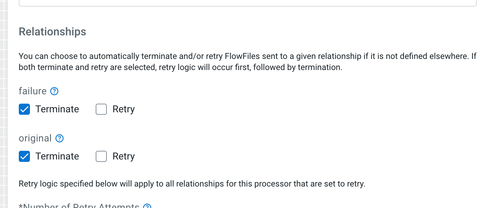</p>

   4. Click **Apply**  
        
    <p align="center">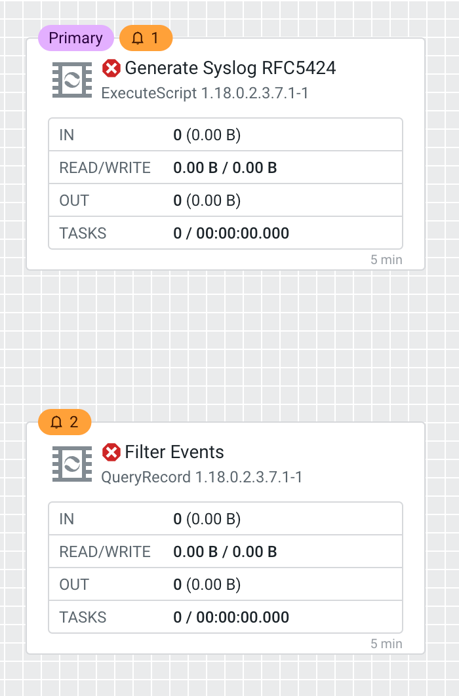</p>

4. Create the **Write To Kafka \- Avro** processor  
     
   1. Drag the Processor icon onto the canvas  
   2. Select the **PublishKafka2RecordCDP** processor.  
   3. Configure the processor as follows:  
      1. Processor Name: **Write To Kafka \- Avro**  
      2. Properties:  
         1. Kafka Brokers: **\#{Kafka Broker Endpoint}**  
         2. Topic Name: **\#{Kafka Destination Avro Topic}**  
         3. Record Reader: **WS\_JSON\_Syslog\_Reader**  
         4. Record Writer: **WS\_Avro\_Syslog\_Writer**   
         5. Use Transactions: **false**  
         6. Security Protocol: **SASL\_SSL**  
         7. SASL Mechanism: **PLAIN**  
         8. Username: **\#{CDP Workload User}**   
         9. Password: **\#{CDP Workload User Password}**   
         10. SSL Context Service: **Default NiFi SSL Context Service**  
         11. To set a specific id for the producer, click on the **Add Property** button to add a property, call it **client.id** and set the value to **\#{Kafka Producer ID}**  
      3. Relationships: check **Terminate** for the **success** relationship  
   4. Click **Apply**  
        
    <p align="center">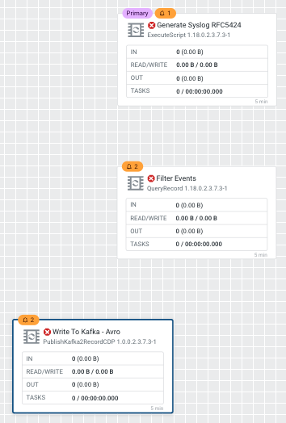</p>
        
5. Create the **Write To Kafka \- JSON** processor  
     
   1. Drag the Processor icon onto the canvas  
   2. Select the **PublishKafka2RecordCDP** processor.  
   3. Configure the processor as follows:  
      1. Processor Name: **Write To Kafka \- JSON**  
      2. Properties:  
         1. Kafka Brokers: **\#{Kafka Broker Endpoint}**  
         2. Topic Name: **\#{Kafka Destination JSON Topic}**  
         3. Record Reader: **WS\_JSON\_Syslog\_Reader**  
         4. Record Writer: **WS\_JSON\_Syslog\_Writer**   
         5. Use Transactions: **false**  
         6. Security Protocol: **SASL\_SSL**  
         7. SASL Mechanism: **PLAIN**  
         8. Username: **\#{CDP Workload User}**   
         9. Password: **\#{CDP Workload User Password}**   
         10. SSL Context Service: **Default NiFi SSL Context Service**  
         11. To set a specific id for the producer, click on the **Add Property** button to add a property, call it **client.id** and set the value to **\#{Kafka Producer ID}**  
      3. Relationships: check **Terminate** for the **success** relationship  
   4. Click **Apply**

    <p align="center"></p>

6. Connect the processors as shown in the diagram below:

* Connect the Processors **Generate Syslog RFC5424** & **Filter Events** for Relationship **success**  
* Connect Processors **Filter Events** & **Write To Kafka \- Avro** for Relationship **filtered\_events**  
* Connect Processors **Filter Events** & **Write To Kafka \- JSON** for Relationship **filtered\_events**  
* Connect **Write To Kafka** to itself to retry for **failures**

    <p align="center">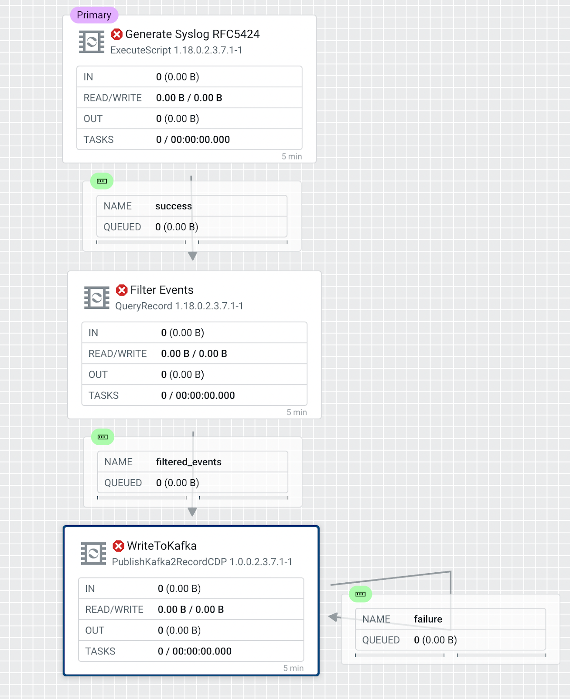</p>


### **3.5 Naming the queues**

Providing unique names to all queues is important when creating flows in CDP-PC. The queue names are used to define Key Performance Indicators and having unique names for them make it easier to understand and create CDF-PC dashboards.

To name a queue, double-click the queue and give it a unique name. The best practice here is to start with the existing queue name (i.e. success, failure, retry, etc…) and, if that name is not unique, add the source and destination processor to the name.

For example:

* The **success** queue between **Generate Flow File** and **Filter Events** should be named   
* The **success** queue between **Filter Events** and **Write To Kafka** should be named **filtered\_event\_Filter-WriteToKafka**  
* The **failure** retry queue from **Write To Kafka** to itself should be named **failure\_WriteToKafka**

    <p align="center">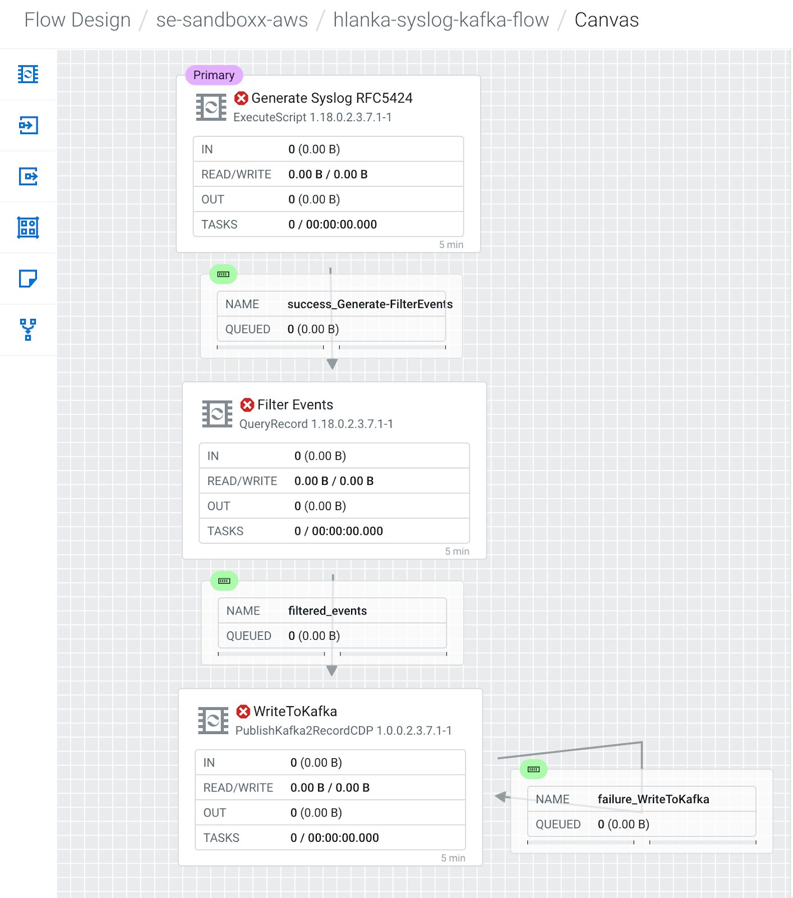</p>


## **4\. Interactively test the flow** 

Test sessions are a feature in the CDF Flow Designer that allow you to start/stop processors and work with live data to validate your data flow logic. 

To test your draft flow, start a Test Session by clicking **Flow Options \> Test Session \> Start Test Session**. This launches a NiFi sandbox to enable you to validate your draft flow and interactively work with live data by starting and stopping components.

**Tip:** You can check the status of your Test Session in the upper right corner of your workspace. That is where you can also deactivate your Test Session.  
<p align="center">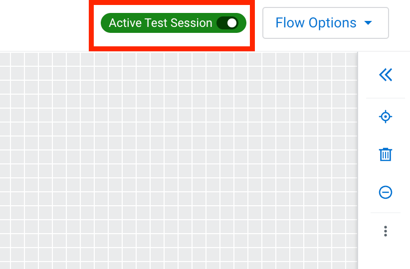</p> 

1. If your test session is not yet started, start one by clicking on **Flow Options \> Test Session \> Start**.

   **Note:** If you had previously started and stopped a test session, the **Start** button is replaced with the **Restart** button. Clicking on **Restart** restarts the session with the same settings used previously. If you want to change the settings, click on the **Edit Settings** button.

2. Click **Start Test Session** (accept all defaults). Test session status changes to **Initializing Test Session…**

 

3. Wait for the status to change to **Active Test Session**.

4. Click **Flow Options \> Services** to enable Controller Services, if not already enabled. 

5. Start all processors that are not running.

   Stopped processors are identified by the icon . Right-click on a stopped processor and select **Start** to start it.

   The flow starts executing. On the Flow Design Canvas you can observe statistics on your processors change as they consume data and execute their respective tasks. 

   <p align="center">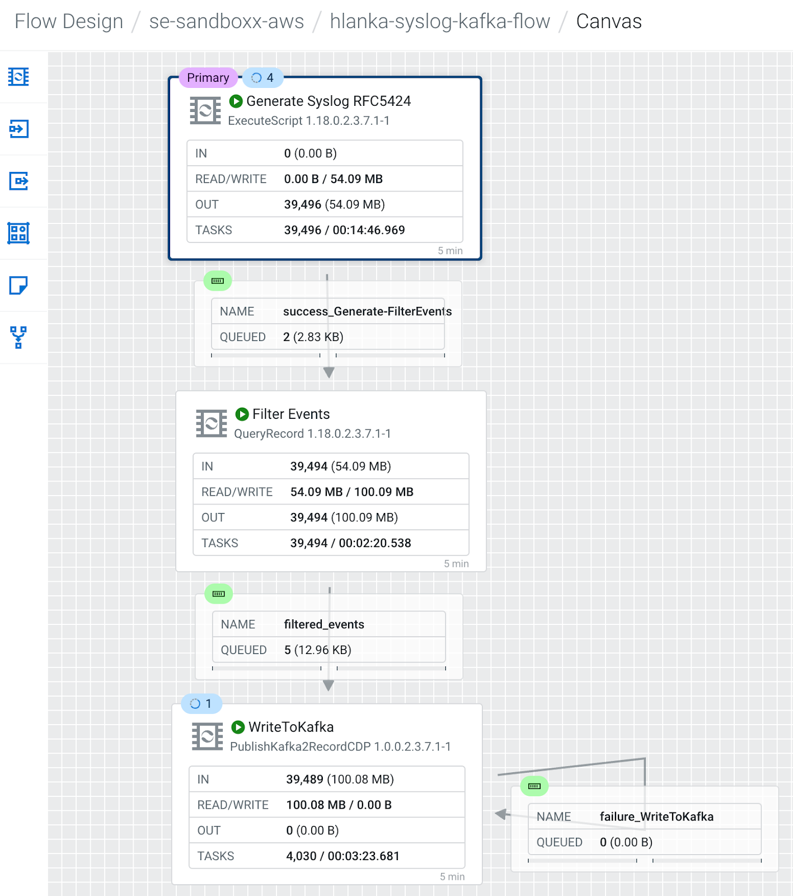</p> 

   You should see the flow running successfully and writing records to Kafka.

   

6. Access the SMM UI from the Streams Messaging DataHub page and check the topic metrics and data:  
     
   <p align="center">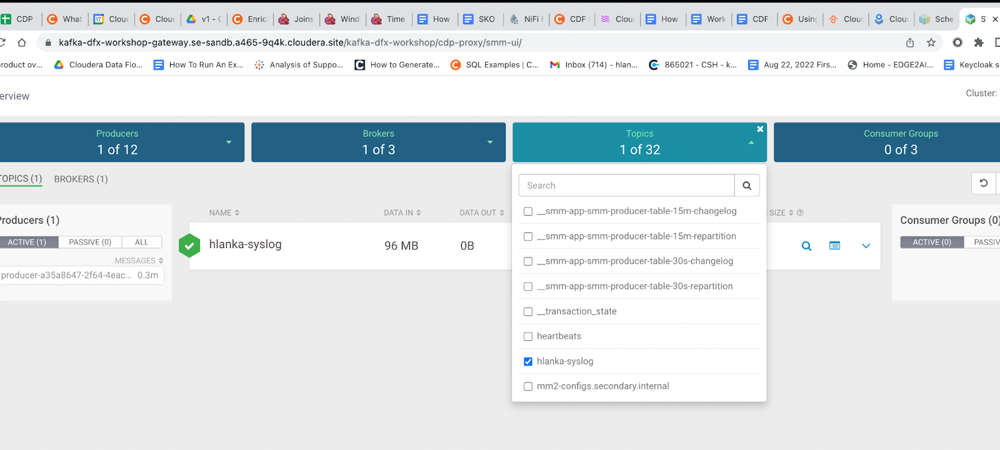</p>   
     
   Here are the topic metrics:  
     
   <p align="center">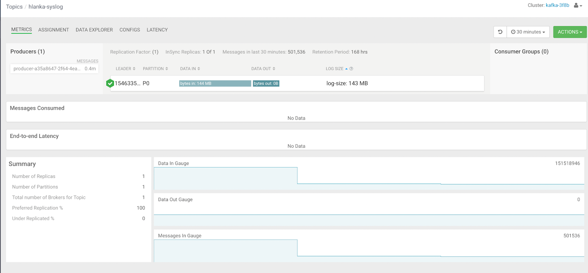</p> 

   You can also view the data from the data explorer:

   

   <p align="center">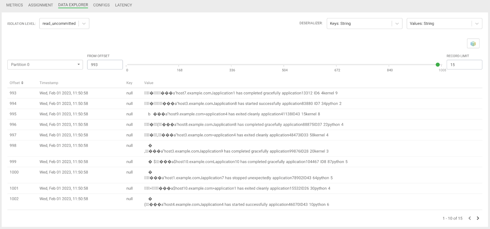</p> 

   

7. You can see that the data in that topic is binary (lots of garbage-like characters on the screen. This is because the topic contains Avro messages, which is a binary serialization format.)

   Fortunately, SMM is integrated to Schema Registry and can fetch the correct schema to properly deserialize the data and present a human-readable form of it.

   To do that select **Avro** as the **Values** Deserializer for the topic:  
   <p align="center">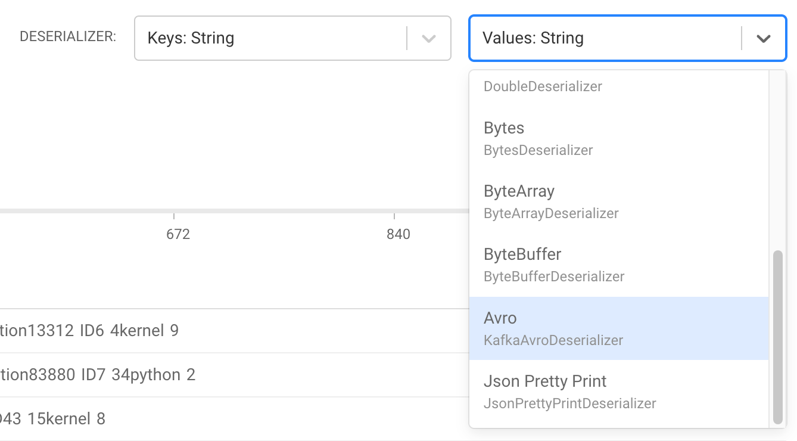</p>   
     
   You will notice that after Avro is selected the messages are shown with a readable JSON encoding:  
   <p align="center">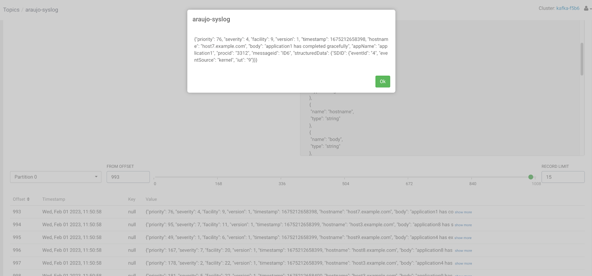</p> 


## **5\. Version Control the flow into the DataFlow Catalog** 

When your flow draft has been tested and is ready to be used you can publish it to the DataFlow Catalog so that you can deploy it from there.

On the first time a flow draft is exported to the catalog you are asked to provide a name for the flow. This name must be unique and must not already exist in the catalog. After a flow is published, subsequent changes that are published will be saved in the catalog as new versions using the same name provided the first time. This name cannot be changed.

When you want to publish a draft flow as a flow definition, you have two options: 

* On the Flow Design Canvas, click Flow Options \> Publish To Catalog \> Publish Flow.  
  <p align="center">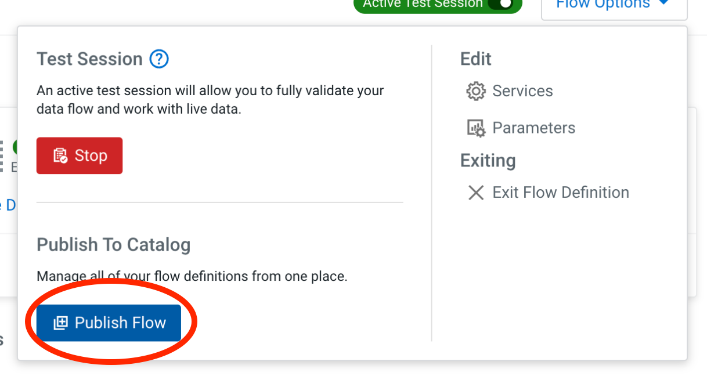</p>  
  **OR**  
* Click on **Flow Design** (left-hand side) to see the **All Flows** page, which lists all the flows. Then click on the 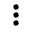menu for the flow you want to publish and select **View Flow Workspace**.  
  <p align="center">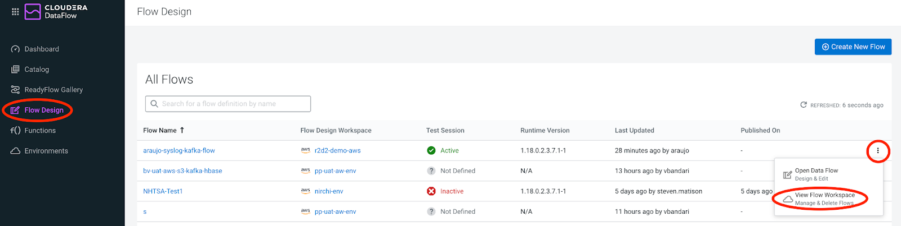</p>   
    
  This will take you to the list of all flows running on the same environment (workspace) as the flow you selected. To publish the flow, Workspace view, click again on the  menu for the desired flow and select **Publish Flow**.   
  <p align="center">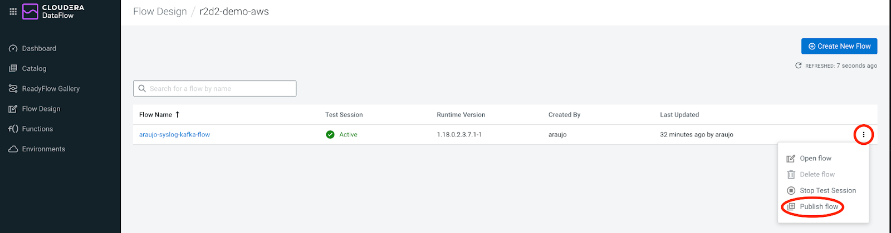</p> 

1. Choose one of the methods explained above and publish your flow.  
2. In the Publish Flow dialog box, enter the following details:  
   1. Flow Name: only when you publish your flow for the first time.  
   2. Flow Description: only when you publish your flow for the first time.  
   3. Version Comments: every time a flow version is published.  
3. Click **Publish**.  
4. Click on **Catalog** and verify that your flow was successfully published.  
5. Make a simple change to your flow (e.g move processors to different positions)  
6. Publish your flow again.  
7. Check that your flow in the Catalog has multiple versions now.

## **6\. Deploy the flow in Production** 

1. Search for the flow in the Flow Catalog  
   <p align="center">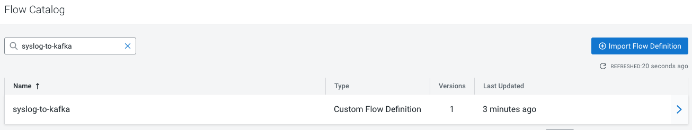</p>  
2. Click on the Flow to see its details, including the list of versions:  
   <p align="center">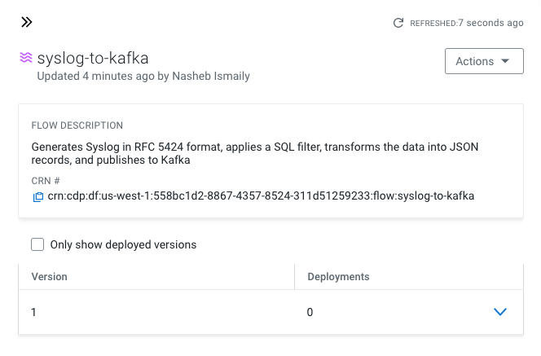</p>  
3. Click on **Version 1**, you should see a **Deploy** Option appear shortly. Then click on **Deploy**.  
   <p align="center">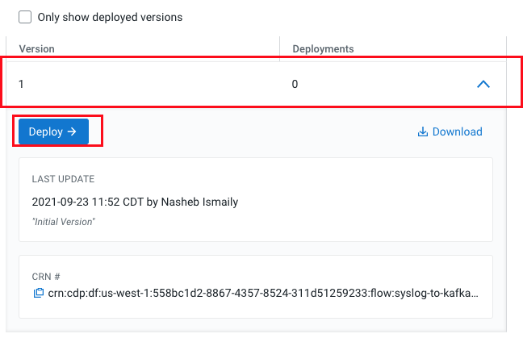</p>  
4. Select the CDP environment where this flow will be deployed and click **Continue**  
   <p align="center">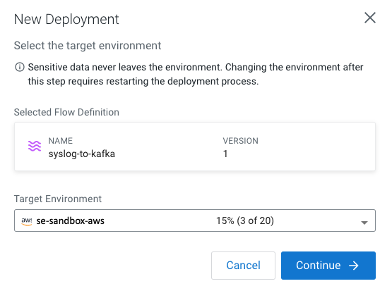</p>  
5. Give the deployment a unique name (e.g **\<userid\>-syslog-to-kafka-001**), then click **Next**  
   <p align="center">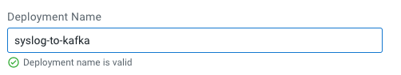</p>  
6. In the **NiFi Configuration** page, accept all the defaults (runtime version, autostart behavior, inbound connections and custom NAR) and click **Next**.  
7. In the **Parameters** page, provide the correct values for the parameter for the production run and then click **Next**. Most of the parameters already have good defaults and you only need to change them if needed. However, you must re-enter the **CDP Workload User Password**.  
* CDP Workload User: The workload username for the current user  
* CDP Workload Password: The workload password for the current user  
* Kafka Broker Endpoint: A comma separated list of Kafka Brokers.   
* Kafka Destination Avro Topic: **\<userid\>-syslog-avro**  
* Kafka Destination JSON Topic: **\<userid\>-syslog-json**  
* Kafka Producer ID: **\<userid\>-producer**  
* Schema Name: **\<userid\>-syslog-avro**  
* Schema Registry Hostname: The hostname of the master server in the Kafka Datahub.  
* Filter Rule: **SELECT \* FROM FLOWFILE**  
    
8. In the **Sizing & Scaling**, select the following and then click **Next**:  
* Size: **Extra Small**  
* Enable Auto Scaling: **True**  
* Min Nodes: **1**  
* Max Nodes: **3**  
  <p align="center">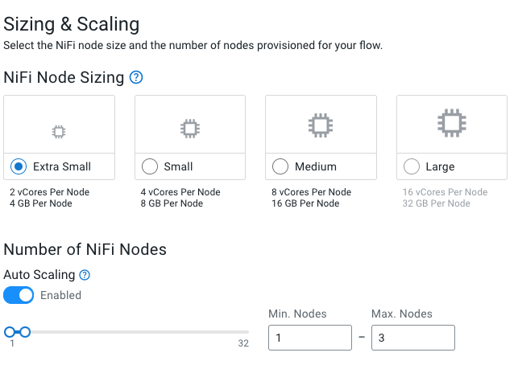</p>  
9. In the Key Performance Indicators page, click on Add New KPI to add the following KPIs.

<p align="center">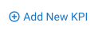</p>

1. Add the following KPI  
* KPI Scope: **Connection**  
* Connection Name: **failure\_WriteToKafka**  
* Metrics to Track: **Bytes Queued**  
* Alerts:  
  * Trigger alert when metric is greater than: **1 MB**  
  * Alert will be triggered when metrics is outside the boundary(s) for: **30 seconds**

    <p align="center">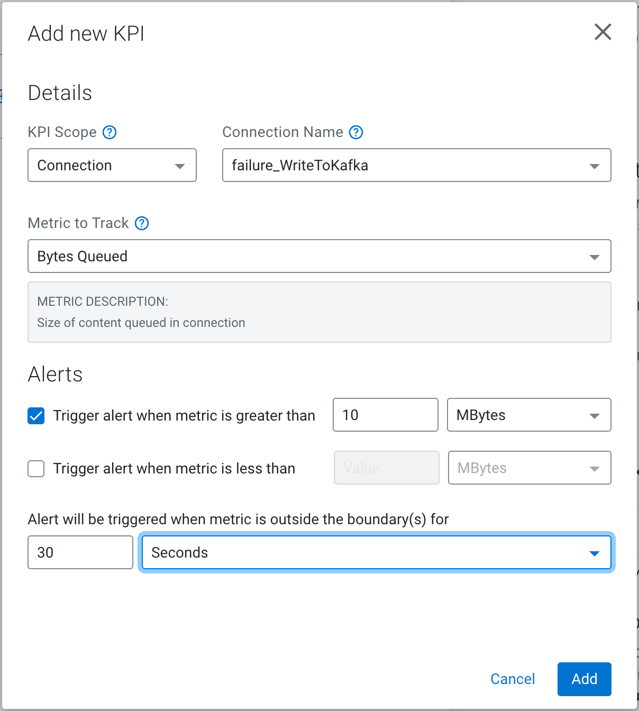</p>

  2.  Add the following KPI  
* KPI Scope: **Connection**  
* Connection Name: **filtered\_event\_Filter-WriteToKafka**  
* Metrics to Track: **Bytes Queued**  
* Alerts:  
  * Trigger alert when metric is greater than: **10 KB**  
  * Alert will be triggered when metrics is outside the boundary(s) for: **30 seconds**

    <p align="center">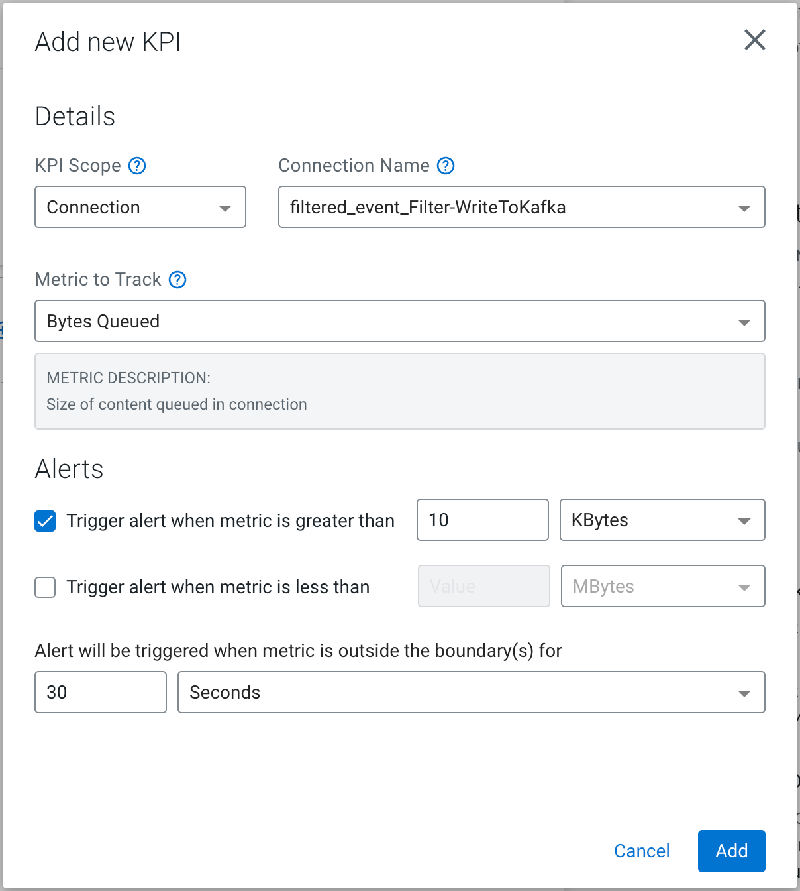</p>

10. Review the KPIs and click **Next**.  
    <p align="center">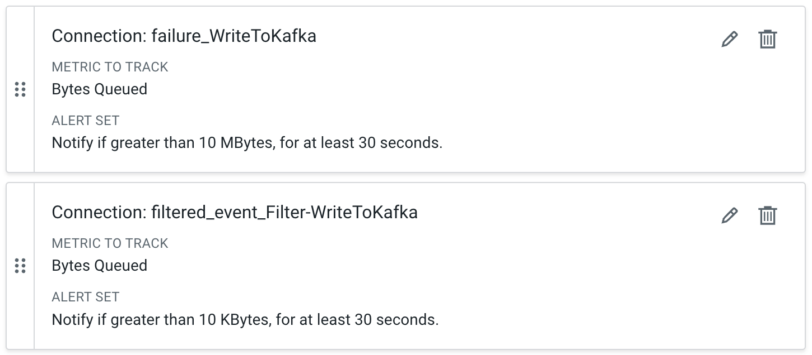</p>  
11. In the **Review** page, review your deployment details.

    Notice that in this page there's a **\>\_ View CLI Command** link. You will use the information in the page in the next section to deploy a flow using the CLI. For now you just need to save the script and dependencies provided there:

    1. Click on the **\>\_ View CLI Command** link and familiarize yourself with the content.  
    2. Download the 2 JSON dependency files by click on the download button:  
       1. Flow Deployment Parameters JSON  
       2. Flow Deployment KPIs JSON  
    3. Copy the command at the end of this page and save that in a file called **deploy.sh**  
    4. Close the **Equivalent CDP CLI Command** tab.

12. Click Deploy to initiate the flow deployment.  
      
13. In the DataFlow **Dashboard,** monitor your flow until it's running successfully (a green check mark will appear once the deployment has completed)  
    <p align="center">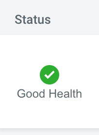</p

14.  Click on your deployment and explore the flow details and monitor the KPI metrics that are shown on this page.  
      
15. Then click on **Manage Deployment** and explore the options under Deployment Settings, which allow you to manage your production flow deployment.  
      
16. Explore the links in the **Actions** menu on this page.

## **7\. Deploy the Flow using CLI** 

In this section you will use the CDP CLI to deploy a flow in Cloudera DataFlow. For this you will use the following files created in the last section:

* **deploy.sh**: file created with the CLI command copied from the CLI Command page.  
* **\<deployment\_name\>-parameter-groups.json**: file downloaded from the CLI Command page, containing the parameter definitions for the deployment  
* **\<deployment\_name\>-kpis.json**: file downloaded from the CLI Command page, containing the KPI definitions for the deployment

1. If you don't have the CDP CLI installed on your laptop, follow the [documentation](https://docs.cloudera.com/cdp-public-cloud/cloud/cli/topics/mc-cli-client-setup.html) to install and configure it.  
2. To test that the CDP CLI is working properly, execute the command below. If the command executes successfully, it will show the details of your CDP account:  
     
   cdp iam get-user

     
   The output should be a JSON like the one below:  
```json 
   {

       "user": {
           "userId": "...",
           "crn": "...",
           "email": "...",
           "firstName": "...",
           "lastName": "...",
           "creationDate": "...",
           "accountAdmin": false,
           "identityProviderCrn": "...",
           "lastInteractiveLogin": "...",
           "workloadUsername": "...",
           "workloadPasswordDetails": {
               "isPasswordSet": true
           }
       }
   }
```
     
     
3. Edit the **deploy.sh** file and modify the details for the following parameters:  
   1. **\--deployment-name**: change the deployment name to something unique. Since you already deployed this flow from the UI you already have a deployment with the name in this file.  
   2. **\--parameter-groups**: replace the \<\<PATH\_TO\_UPDATE\>\> string with the full path of the parameter group definition file. E.g.:  
```json 
      file:///Users/rbearden/Downloads/syslog001-parameter-groups.json
```

        
   1. **\--kpis**: replace the \<\<PATH\_TO\_UPDATE\>\> string with the full path of the KPI definition file. E.g.:  
```json    
      file:///Users/rbearden/Downloads/syslog001-kpis.json
```
     
1. Edit the **\<deployment\_name\>-parameter-groups.json** file and replace the **\<\<CDP\_MISSING\_SENSITIVE\_VALUE\>\>** string with the proper value for the corresponding parameter(s).

   You can also change values of other parameters if wanted/needed.  
     
2. Execute the deploy.sh script to create the new flow deployment:  
```json 
   bash deploy.sh
```
     
3. Go to the Cloudera DataFlow Dashboard, monitor the flow deployment and verify that the deployment completes successfully.
