# **Module 2 - Streaming Analytics with Cloudera Stream Processing**

## **1. Overview**

In this module you will practice the streaming analytic capabilities of Cloudera Stream Processing using SQL Stream Builder to develop and deploy a real-time streaming job in production. You will leverage the NiFi Flow deployed in CDF-PC from the previous workshop and demonstrate how to query live data and subsequently sink it to another location. You will learn to:

* Use Stream Messaging Manager to inspect Kafka topics.  
* Create a Project in SQL Stream Builder (SSB).  
* Register Schema Registry and Kudu Catalogs in SSB.  
* Create Virtual Tables in SSB.  
* Create and execute Jobs in SSB.

## **2. Inspect Kafka topics in SMM**

Use SMM to to show the kafka topics **<userid>-syslog-avro** that is being written to from the NiFi flow in module 1

1. Login to **SMM**.  
2. Click on the **Topics icon** 
   
3. and filter the topic **<userid>-syslog-avro**, which was created by the NiFi flow in Module 1  
   <p align="center">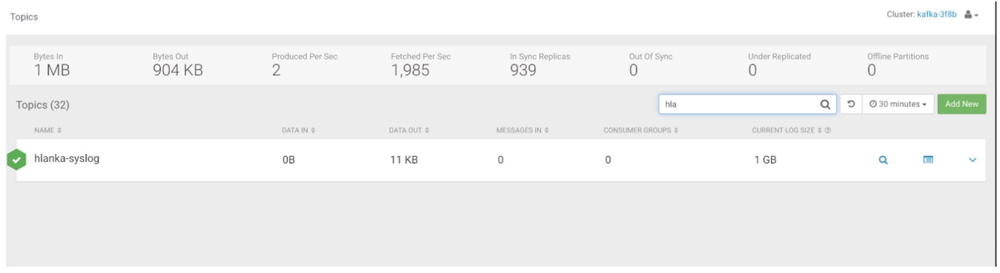</p>

4. Click on the **Profile** icon for the topic, as shown below:  
   <p align="center">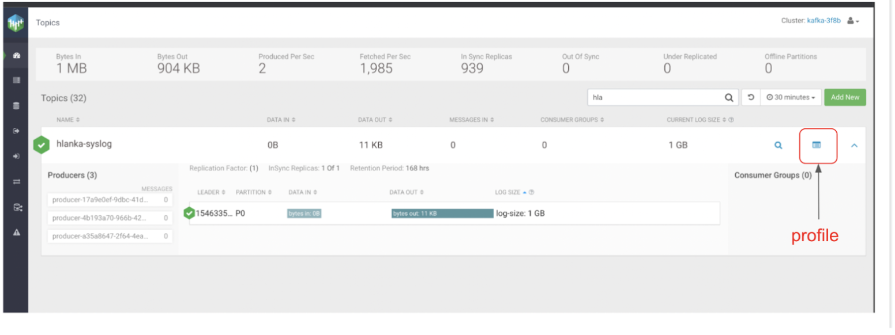</p>

5. On the Topic page, click on the **DATA EXPLORER** tab:  
   <p align="center">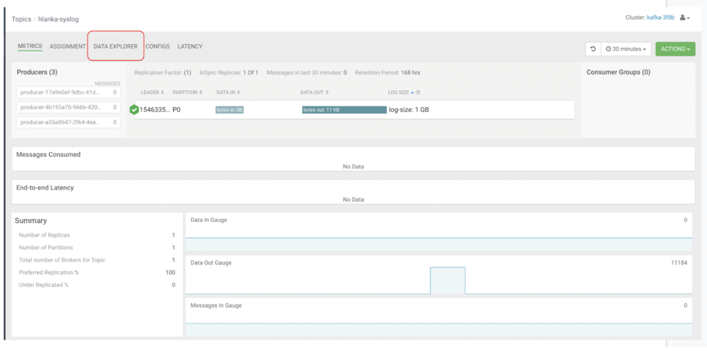</p>

6. Use the Data Explorer tool for the Avro topic and verify that the data is binary. Change the Value Deserializer to **Avro** to use the Schema Registry integration and verify that the data was deserialized correctly:  
   <p align="center">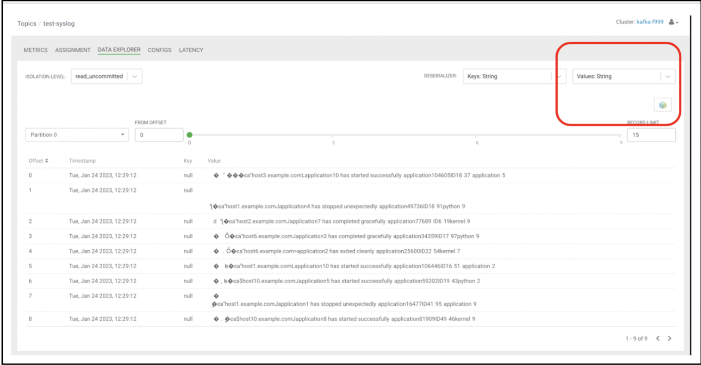</p>
   <p align="center">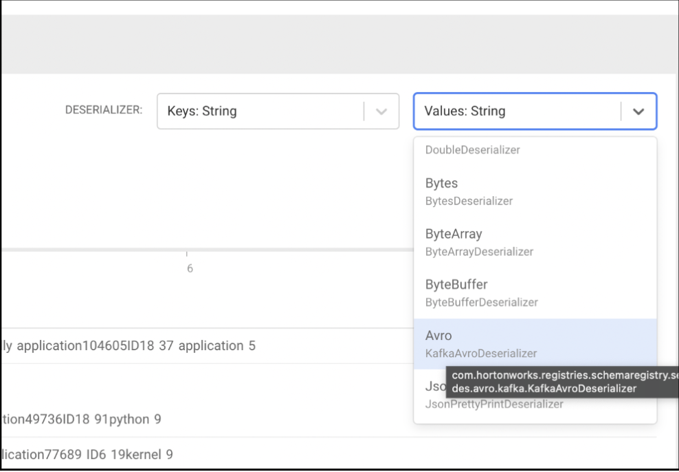</p>
   <p align="center">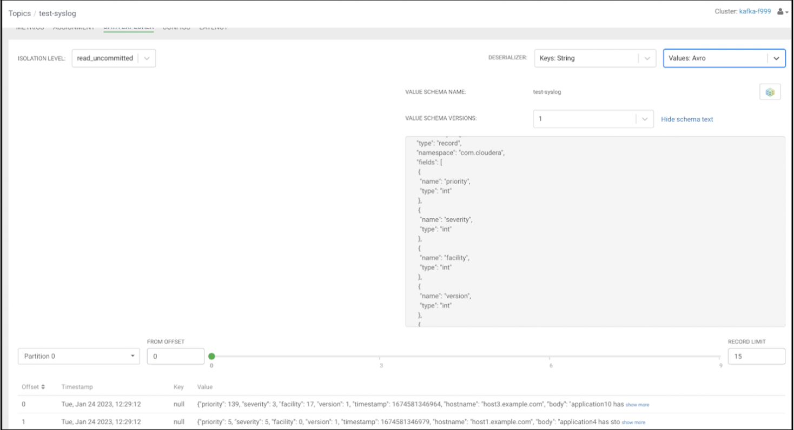</p>

## **3. Create a Project in SSB and configure GitHub repo for it**

In this section you will start getting familiar with SQL Stream Builder (SSB) and will create a project in it to use throughout the remainder of this workshop. Projects in SSB can be stored in a Git repository and you will learn how to configure your project to use one.

Before you do that, though, you need to create a Git repository under your own GitHub account. It is recommended that you *register a SSH key with your GitHub account* so that you can use SSH authentication. Using BASIC authentication (username and password) is not recommended since that will not work if you have two-factor authentication enabled for it.

1. Login to [github.com](http://github.com) with your own personal user.

> ⚠️ **Important: Use a Public GitHub Account**
>
> You must use a personal account from the public `github.com` website. The internal Cloudera GitHub is not accessible by `SSB` and will not work.
   

2. Click on **Settings** for your account and then on the **SSH and GPG keys** menu. If you already have a SSH key registered and you have a copy of the private key in your computer, you can use it when configuring your Project in SSB.

   If you don't have a SSH key register or don't know where it's the private key file associated with the registered key, click on the **New SSH key** button and create/register a new one.

   <p align="center">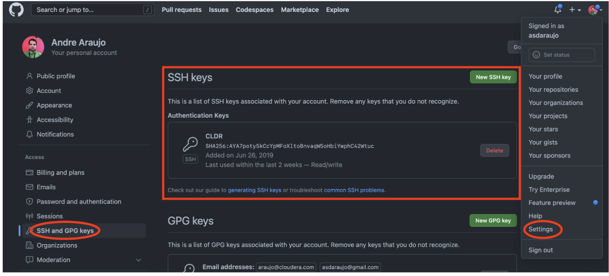</p>
     
3. Click the "plus" icon at the top right of the page and select **New repository** to add a new repository. Call it **ssb-workshop** and set it like the one below:

   <p align="center">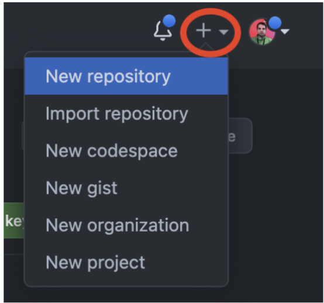</p>

4. Make sure that the “Add a README file” option is checked.  
   <p align="center">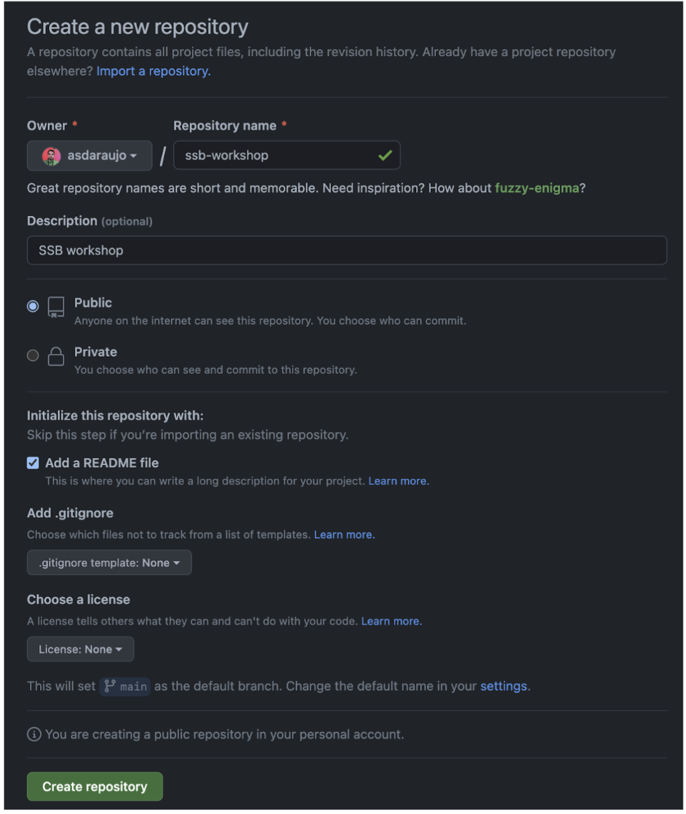</p>
     
5. Once the repository is created, click on the Code button on the repository page, select the SSH tab and copy the associated URL. This is the URL you will use to configure the SSB project:

   <p align="center">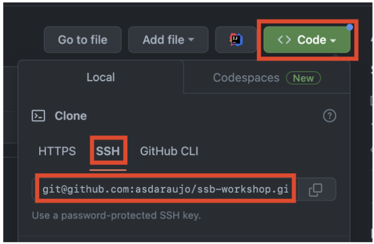</p>
     
6. In the CDP Console, find the **Streaming Analytics (Flink) DataHub** and click on it to open the DataHub page.  
7. Click on the  icon to open the SSB UI. You will notice that there are already two projects created by default:  
   1. **ssb_default** - a global project accessible to all users  
   2. **<userid>_default** - a private project accessible only to your user  
      
   You won't use any of those. Instead, you will create a GitHub-backed repository next.  
     
8. In the **Projects** page, click on the **New Project** button:  
   <p align="center">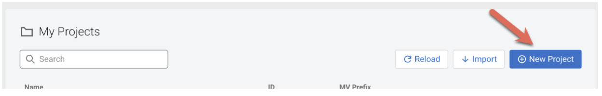</p>

9. Enter the following details in the Create Project dialog box:  
      1. Name: **\<an unique name for your project\>**  
      2. Clone URL: **\<the URL you copied in step 4\>**  
      3. Branch: **main** (by default a GitHub repository is created with a **main** branch. If you modified that, make sure you specify the correct branch name here)  
      4. Authentication: **Enabled**  
      5. Method: **SSH**  
      6. Private Key: **\<upload the private key file associated with the key in your GitHub account\>**  
      7. Public Key: **\<upload the public key file associated with the key in your GitHub account\>**  
      8. Passphrase for Private Key: **\<if your private key is protected by a passphrase, enter it here; otherwise, leave it blank\>**  
      <p align="center">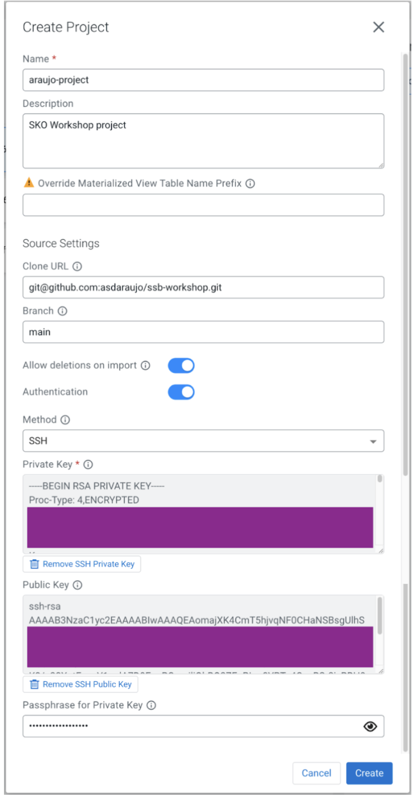</p>

10. The new project will be listed in the Projects page:  
    <p align="center">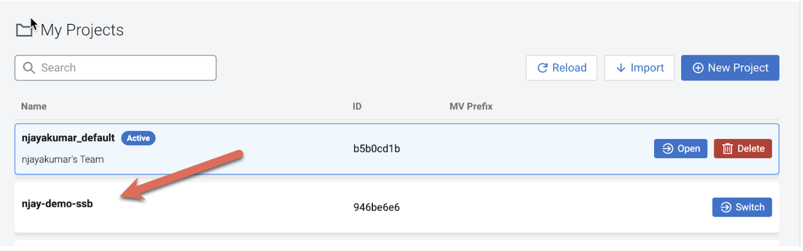</p>

11. Click on the **Switch** button of the new project to switch to it, and you will see the main page for your project::  
    <p align="center">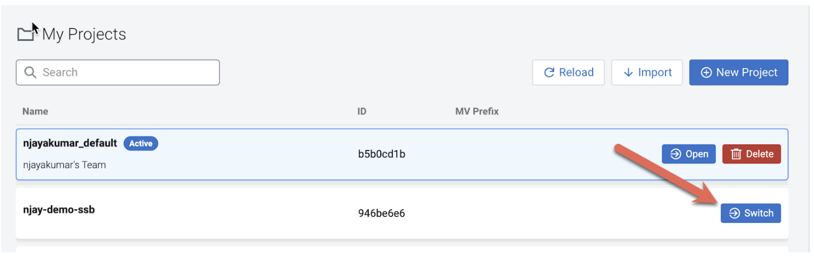</p>
    <p align="center">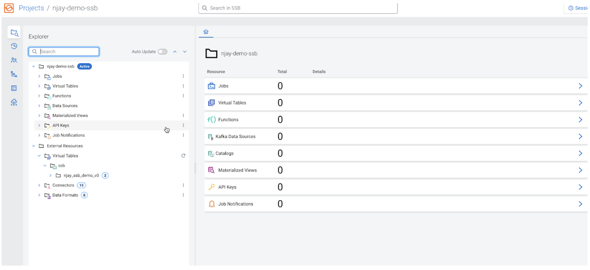</p>

##  **4. Register a Kafka Data Source**

Before you can use SSB to process data from Kafka topics you must register one or more Kafka clusters as Data Sources in your project. In this section you will register the Kafka DataHub as your data source.

1. In your project workspace, expand the Data Sources item in the navigation tree. You will see two items under it: "Kafka" and "Catalog"  
2. Click on the kebab menu () of the **Kafka** node to create a new Kafka data source:  
   <p align="center">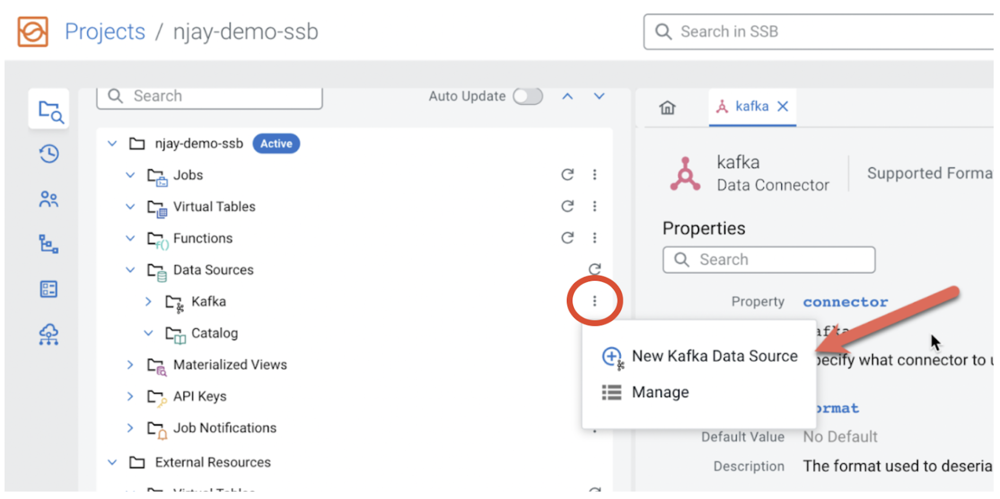</p>

3. Provide the following details in the Kafka Data Source dialog box:  
      1. Name: **<name of your data source. E.g. dh-kafka\>**  
      2. Brokers: **<comma-separated list of brokers\>** (See the Notes under Module 1's section 3.2.2 for more details on how to find the Kafka broker addresses)  
      3. Protocol: **SASL/SSL**  
      4. SASL Mechanism: **PLAIN**  
      5. SASL Username: **<your workload username\>**  
      6. SASL Password: **<your workload password\>**

      <p align="center">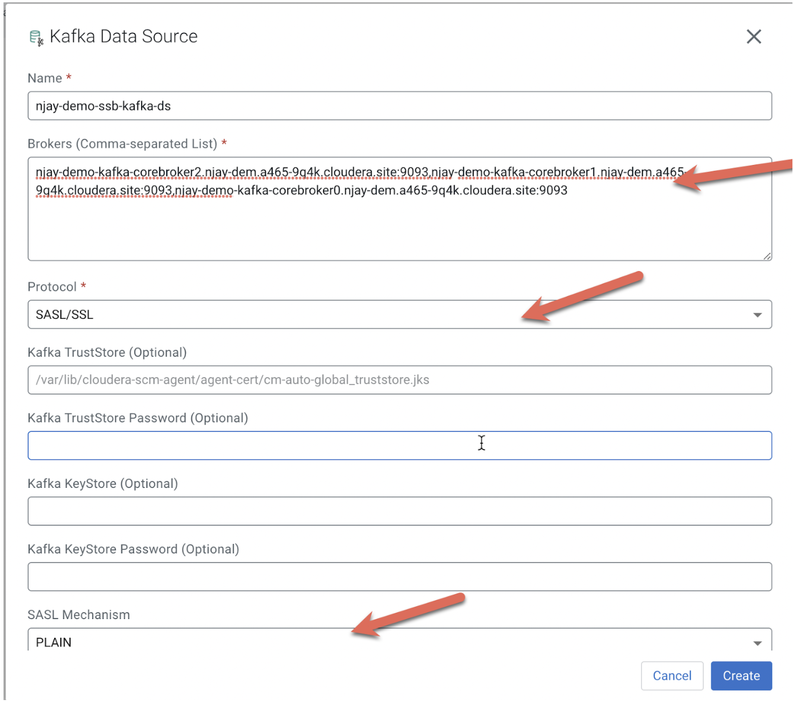</p>
      <p align="center">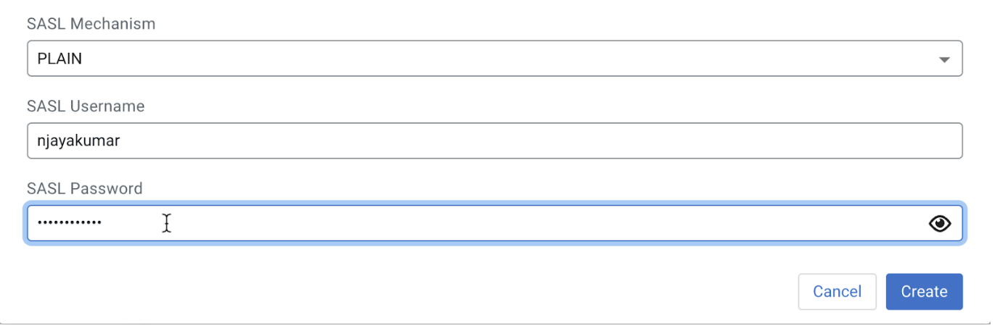</p>

## **5. Register a Schema Registry catalog**

Schema Registry stores schemas that are used to read/write data from/to Kafka topics. Registering a Schema Registry instance in SSB automatically creates SSB tables for the schemas retrieved from it, making it simpler to start accessing data from those topics.

**Note**: For this to work the schemas stored in Schema Registry need to be stored with the same name of the Kafka topic.

1. In your project workspace, navigate to **Data Sources \-\> Catalog.** Click the kebab menu of the Catalog item and select **New Catalog** to create a new catalog.

   <p align="center">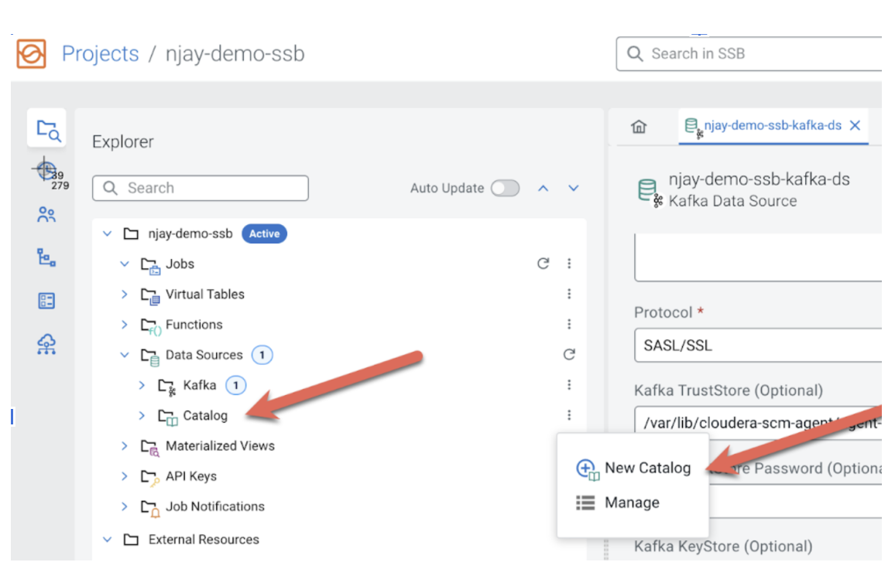</p>

2. Enter the following details in the Catalog dialog box:  
      1. Name: **<name of the catalog. E.g. dh-schreg\>**  
      2. Catalog Type: **Schema Registry**  
      3. Kafka Cluster: **<select the Kafka data source you created the previous section\>**  
      4. Enable TLS: **Enabled**  
      5. Schema Registry URL: **https://<schreg\_hostname\>:7790/api/v1** (See the Notes under Module 1's section 3.2.2 for more details on how to find the Schema Registry hostname)

   <p align="center">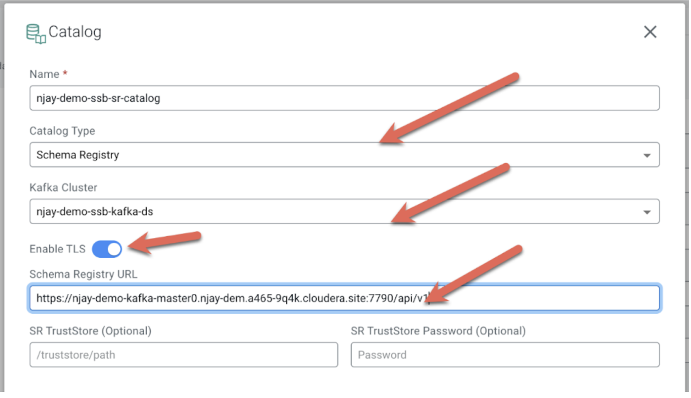</p>

3. Click on the **Validate** link to validate the Catalog. If the catalog is successfully validated you will see a message saying "Data Source is valid". If you hover the mouse over that message you will see how many tables were discovered from Schema Registry during the validation:  
   <p align="center">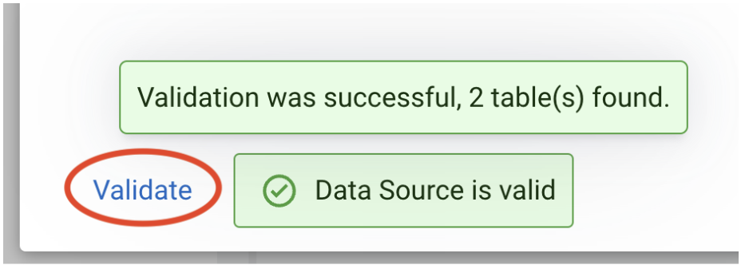</p>

4. Once the catalog is validated. Press the **Create** button to register the Schema Registry catalog.  
   <p align="center">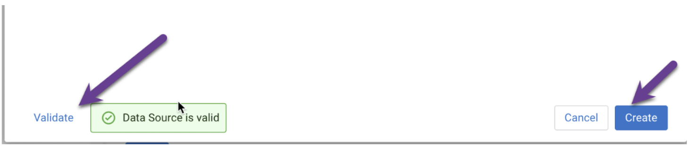</p>

5. After the registration is completed you can browse the Schema Registry tables by navigating to **External Resources\> Virtual Tables \> \[schema\_registry\_catalog\_name\] \> default\_database**:

   <p align="center">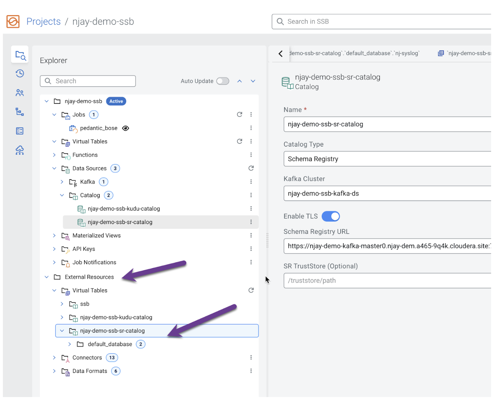</p>

6. The Virtual Tables are created based on the schemas retrieved from Schema Registry. Virtual table names are the same as that of schema names. 

   **Note:** The topic names in Kafka must also be the same as the name of the schema associated with it.

   <p align="center">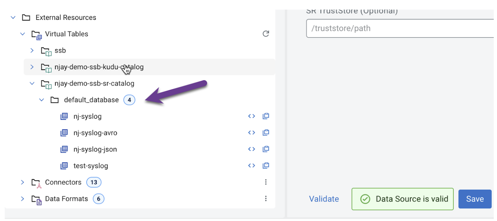</p>

## **6. Register a Kudu catalog**

Similar to a Schema Registry catalog, a Kudu catalog makes Kudu tables automatically available for use in SSB, simplifying the process of mapping Virtual Tables to the actual Kudu ones. In this section you will register the DataHub Kudu cluster as a catalog in your SSB project.

This will make the **syslog\_severity** table, which has already been created in Kudu, available for queries in SSB.

1. In your project workspace, navigate to **Data Sources \-\> Catalog.** Click the kebab menu of the Catalog item and select **New Catalog** to create a new catalog.

2. Enter the following details in the Catalog dialog box:  
      1. Name: **\<name of the catalog. E.g. dh-kudu\>**  
      2. Catalog Type: **Kudu**  
      3. Kudu Masters: **\<kudu\_master1\>:7051,\<kudu\_master2\>:7051,\<kudu\_master3\>:7051** *(see **Notes** below)*  
        
      <p align="center">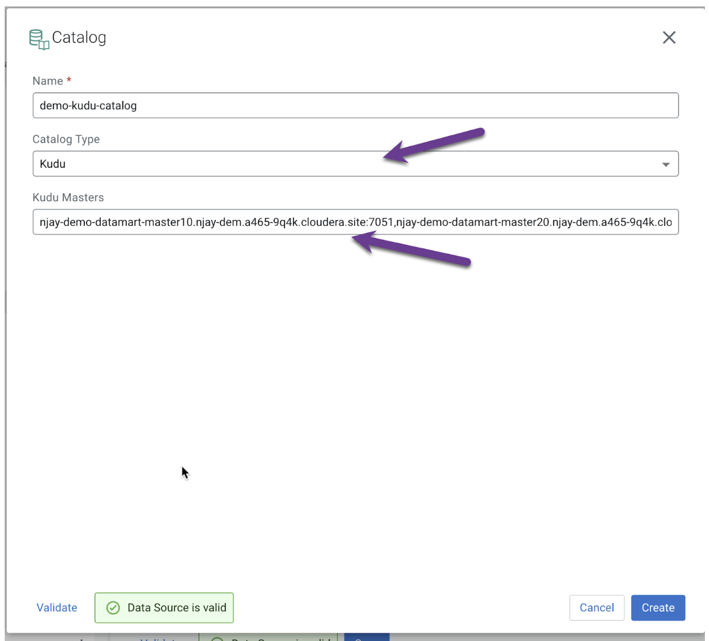</p>

   **Notes:**  
* **Kudu Masters:** The hostname of the Kudu master nodes can be found in the Real-time Data Mart (Kudu) DataHub page. In the CDP Console, find your Real-time Data Mart DataHub and click on the **Nodes** tab. Copy the FQDN for the 3 masters, as shown in the screenshot below.

  The full masters address to be provided during the catalog registration is the following:

  <p align="center">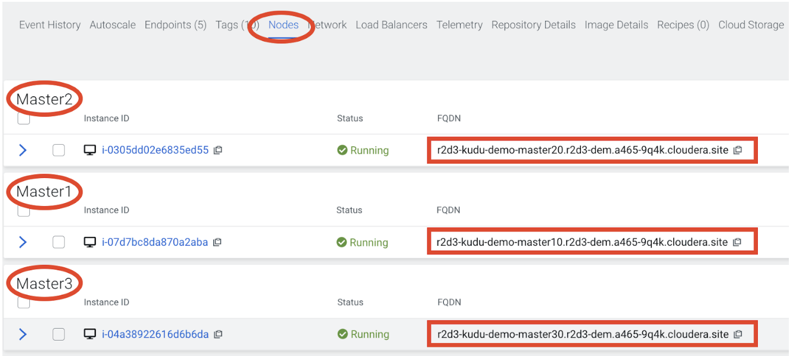</p>  
    
3. Click on the **Validate** link to validate the Catalog. If the catalog is successfully validated you will see a message saying "Data Source is valid". If you hover the mouse over that message you will see how many tables were discovered from Schema Registry during the validation:  
   <p align="center"></p>

4. Once the catalog is validated. Press the **Create** button to register the Kudu catalog.  
   <p align="center"></p>

5. After the registration is completed you can browse the Kudu tables by navigating to **External Resources\> Virtual Tables \> \[kudu\_catalog\_name\] \> default\_database**:

   <p align="center">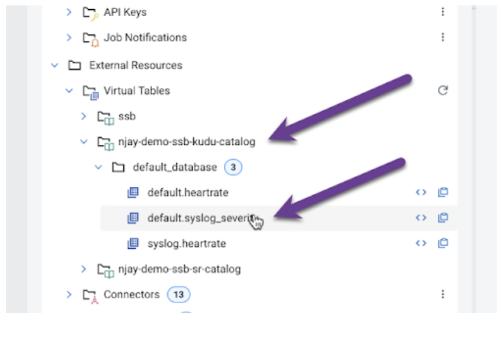</p>

## **7. Create a Kafka Table manually**

You saw that when you register a Schema Registry catalog SSB automatically maps all the schemas found in there as SSB tables that can be used to access data in the Kafka topics named after the schemas.

Sometimes, though, you don't have a schema for a particular topic and you may still want to consume or produce data to that topic. In SSB you can manually create a table and specify its schema directly, as well as the mapping to an existing Kafka topic. In this section you will practice this using the Add Table wizard.

1. In your project workspace, navigate to **Data Sources \-\> Virtual Tables.**   
     
2. Click the kebab menu of the Virtual Tables item and select **New Kafka Table** to create a new virtual table.

   <p align="center">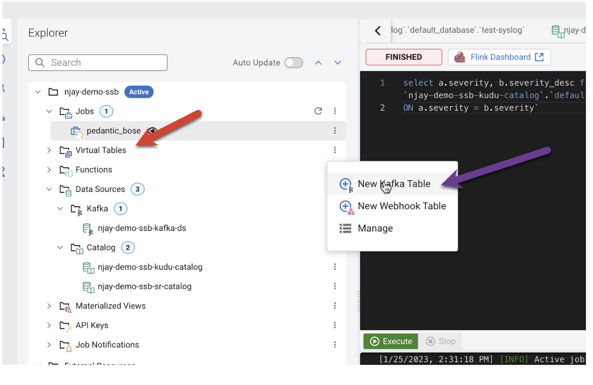</p>

3. Enter the following details in the Kafka Table dialog box:  
   * Table Name: **syslog\_data**  
   * Kafka Cluster: **\<select the Kafka data source you created previously\>**  
   * Data Format: **JSON**  
   * Topic Name: **\<userid\>-syslog-json**

     <p align="center">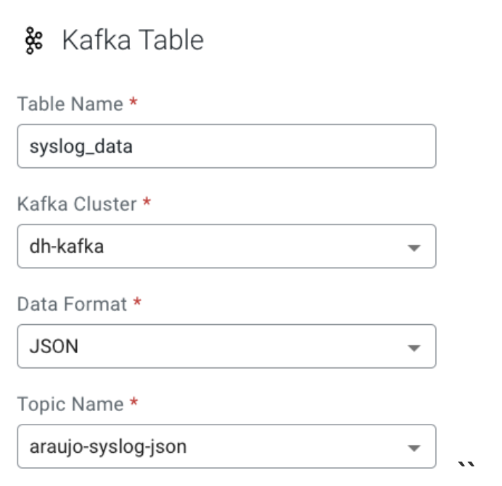</p>

4. When you select Data Format as AVRO, you must provide the correct Schema Definition when creating the table for SSB to be able to successfully process the topic data.


   For JSON tables, though, SSB can look at the data flowing through the topic and try to infer the schema automatically, which is quite handy at times. Obviously, there must be data in the topic already for this feature to work correctly.

   **Note:** SSB tries its best to infer the schema correctly, but this is not always possible and sometimes data types are inferred incorrectly. You should always review the inferred schemas to check if it's correctly inferred and make the necessary adjustments.

   Since you are reading data from a JSON topic, go ahead and click on **Detect Schema** to get the schema inferred. You should see the schema be updated in the **Schema Definition** tab.  
     
5. You will also notice that a "Schema is invalid" message appears upon the schema detection. If you hover the mouse over the message it shows the reason:  
     
   <p align="center">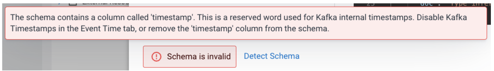</p>  
     
   You will fix this in the next step.  
     
6. Each record read from Kafka by SSB has an associated timestamp column of data type TIMESTAMP ROWTIME. By default, this timestamp is sourced from the internal timestamp of the Kafka message and is exposed through a column called eventTimestamp. 

   However, if your message payload already contains a timestamp associated with the event (event time), you may want to use that instead of the Kafka internal timestamp.

   In this case, the syslog message has a field called "**timestamp**" that contains the timestamp you should use. You want to expose this field as the table's "**event\_time**" column. To do this, click on the Event Time tab and enter the following properties:  

   * Use Kafka Timestamps: **Disable**  
   * Input Timestamp Column: **timestamp**  
   * Event Time Column: **event\_time**  
   * Watermark Seconds: **3**

   <p align="center">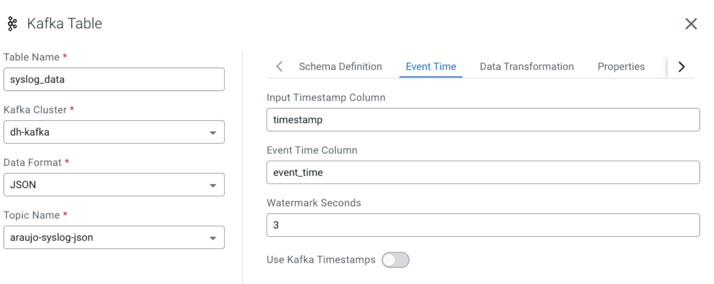</p>

7. Now that you have configured the event time column, click on **Detect Schema** again. You should see the schema turn valid:  
   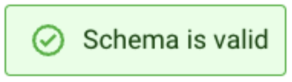
     
8. Click the **Create and Review** button to create the table.  
9. Review the table's DDL and click **Close**.  
   

## **8. Unlock your keytab**

Before running jobs in SSB you must unlock your keytab following the steps below:

1. Ensure you are at the SSB home page. If not in the home page, click the Projects link at the top of the screen  
2. Click on your user's icon/name at the bottom-left of the screen and select **Manage Keytab**:  
   <p align="center">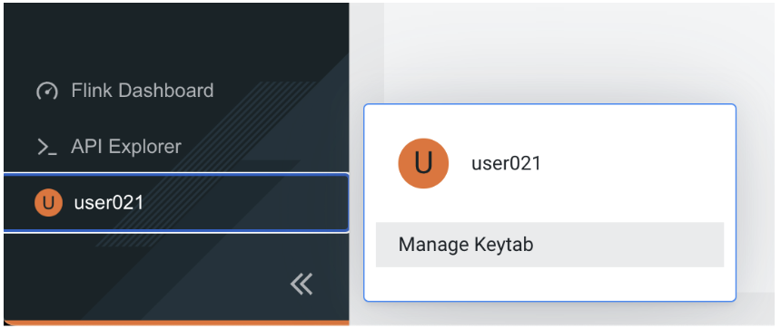</p>
3. Enter your username and password and click on **Unlock Keytab**:  
   <p align="center">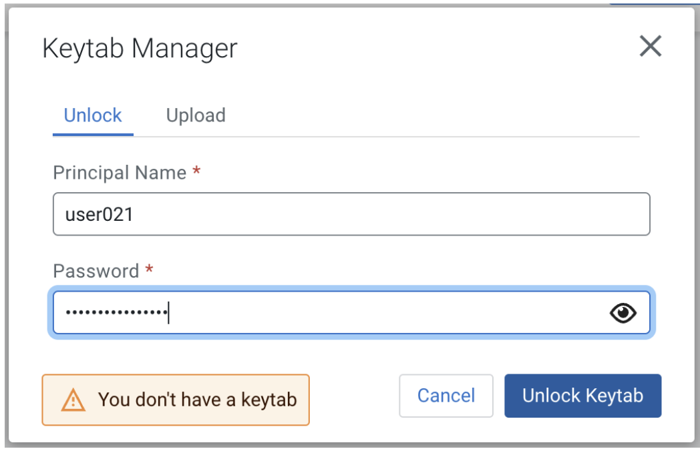</p>

## **9. Create Streaming SQL jobs**

In this section you will practice creating and executing SQL Streaming jobs to implement different types of use cases. You will create the following jobs:

* Job 1: Selecting records from a Kafka virtual table  
* Job 2: Selecting records from a Schema Registry virtual table  
* Job 3: Using a windowing function  
* Job 4: Enriching streaming data with data-at-rest data sources

### **9.1. Job 1: Selecting records from a Kafka virtual table**

1. In the SSB console, ensure you have switched to your project and you are at your project's main page.  
2. On the Explorer view, click the kebab menu ()  of the **Jobs** item and select **New Job** to create a new one.

   <p align="center">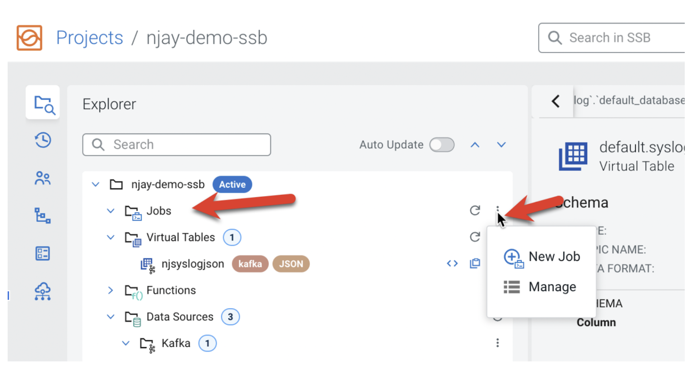</p>

3. Enter **job1** as a **Job Name** and click on the **Create** button:

   <p align="center">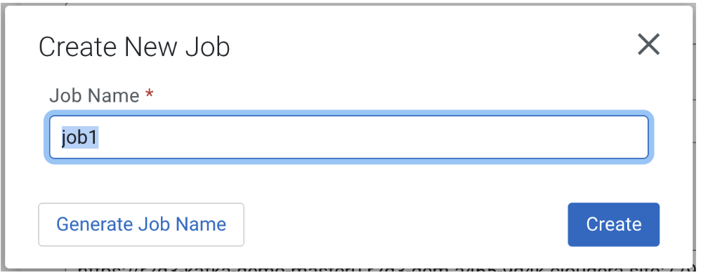</p>
     
   You are redirected to the SQL Editor where you can perform a number of tasks, including:  
   1. Compose and execute SQL queries  
   2. Create and manage Materialized Views  
   3. Configure your SQL job

   <p align="center">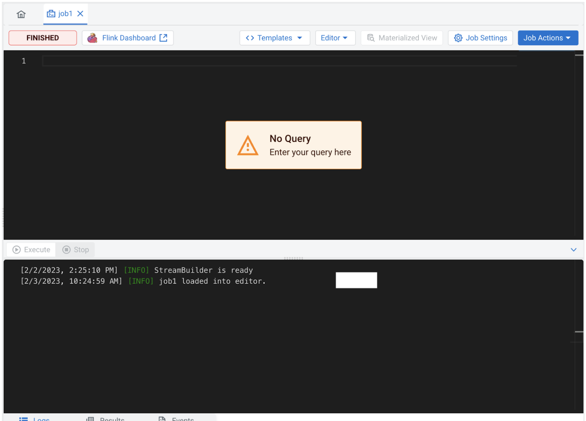</p>

4. Click on the SQL editor area and type the job query.

   In this first job you will simply select everything from the **syslog\_data** table that you created previously. Notice that the editor has auto-completion for keywords, table names, etc. As you type you will see suggestions for completion being shown. To select one of the options, simply use the arrow keys to scroll to the option and press **\<ENTER\>**.

   If the list of options doesn't not show at a particular position of the cursor you can press \<CTRL\>+\<SPACE\> to show the list of completion suggestions.  
     
5. In the editor type "**SELECT \* FROM** " (with a space in the end) and then press \<CTRL\>+\<SPACE\>. Select the syslog\_data table from the list.

   <p align="center">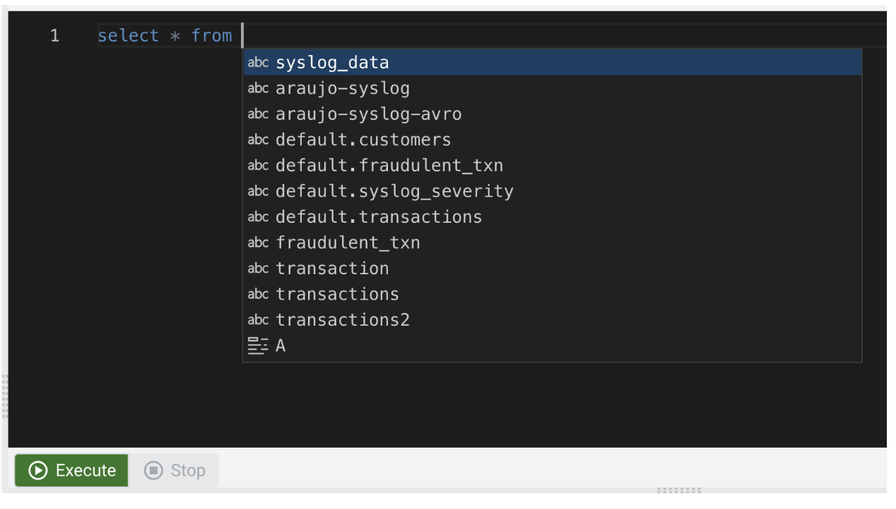</p>

6. Click **Execute**.

   The Logs tab will show that the job execution has started and once data is retrieved it will automatically switch to the Results tab to show the results:

   <p align="center">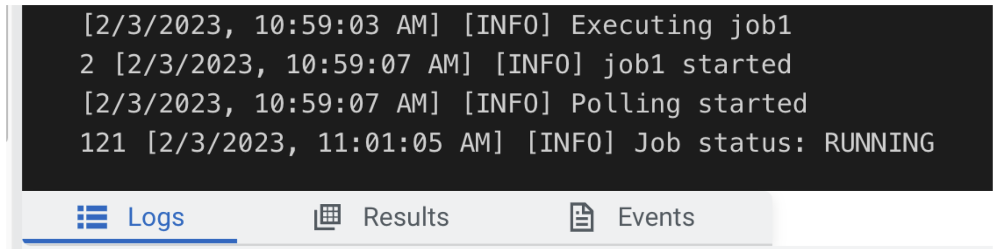</p>
   <p align="center">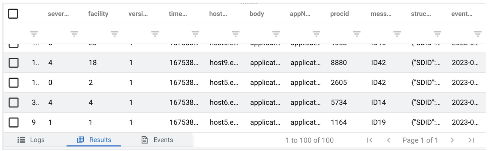</p>  
     
7. You will notice that the Results tab shows approximately one record every second, even though there is a lot more data flowing through the Kafka topic. This is because, by default, SSB only shows a sample of the data on the screen to give the user some feedback about what the query is retrieving. If you leave the query running you will also notice that the sample polling will automatically stop once 100 records have been retrieved.

   You can change the sample behavior and other settings by clicking on the Job Settings button, as shown below:

   <p align="center">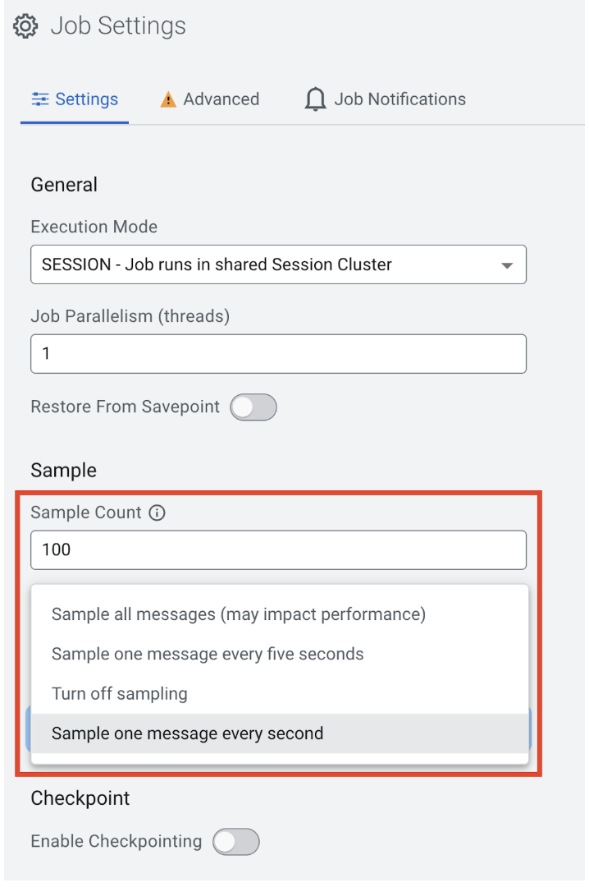</p>

   **NOTE:** Selecting "Sample all messages" can have a negative effect in performance and will increase the resource consumption of your browser as well. Use this only when necessary to check or troubleshoot data.

8. From the Results tab you can see that the data contains records of all severities. If you want to change that you can simply stop and edit your query and run it again.

   Click **Stop** to stop the job and edit the query so that it retrieves only records with severity 3:
```json
   SELECT \*

   FROM syslog\_data

   WHERE severity \= 3
```
     
   Click **Execute** and check the results to confirm that the change was effective.

9. Once you're done, **Stop** your job. In the Explorer tree you can see all the jobs and which ones are running. You can also stop jobs from there by right-clicking on the job item. If the job status doesn't look correct, try click on the Reload icon, shown below:

   <p align="center">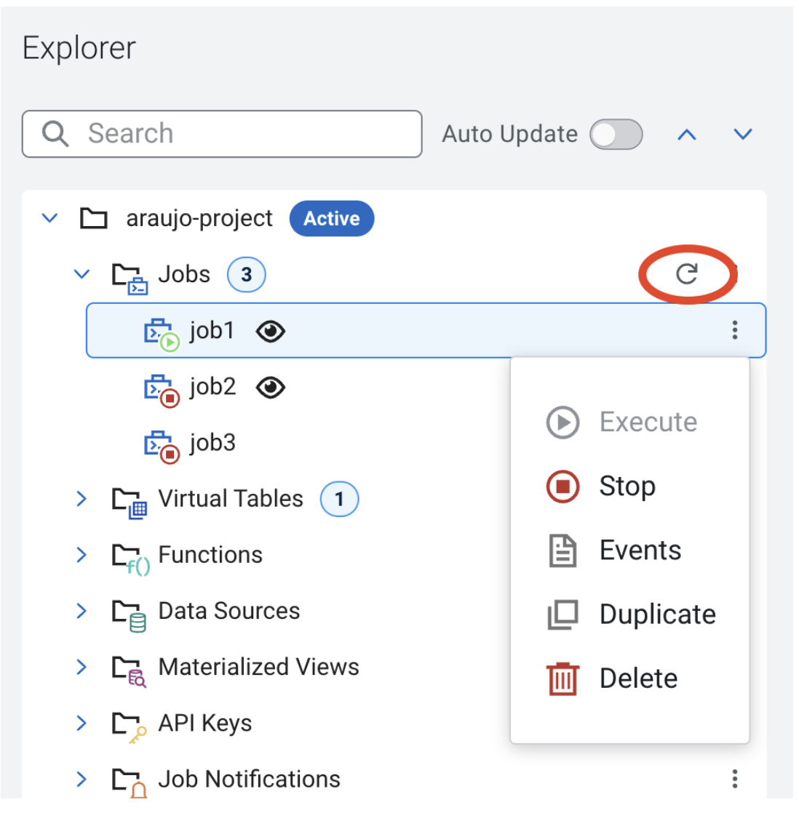</p>

### **9.2. Job 2: Selecting records from a Schema Registry virtual table**

Once virtual tables are created in SSB, their backend and data format are transparent to the user. Tables can be queried in SSB in exactly the same way. In this section you will execute the same query from job1 against a table that comes from an Kafka topic with AVRO format and will see that everything works the same:

1. On the Explorer view, right-click on the **Jobs** item and select **New Job** to create a new job. Call it **job2**.

2. Enter the same query from the previous job, but using the **\<userid\>-syslog-avro** table (use the auto-completion to find the correct table name \- **\<CTRL\>+\<SPACE\>**). You will notice that the auto-completion will prefix the table name with the catalog and database names:
```json
   SELECT \*

   FROM **\[auto-complete the table \<userid\>-syslog-avro\]**

   WHERE severity \= 3
```
     
   Click **Execute** and check the results to verify that everything works as expected.

3. Once you're done, **Stop** your job.

### **9.3. Job 3: Using a windowing function**

One powerful feature of Flink and SSB is the ability to perform windowing aggregations on streaming data. For more information on all the aggregation options available, please check the Flink documentation about [table-valued functions](https://nightlies.apache.org/flink/flink-docs-master/docs/dev/table/sql/queries/window-tvf/), [window aggregation](https://nightlies.apache.org/flink/flink-docs-master/docs/dev/table/sql/queries/window-agg/), [group aggregation](https://nightlies.apache.org/flink/flink-docs-master/docs/dev/table/sql/queries/group-agg/) and [over aggregation](https://nightlies.apache.org/flink/flink-docs-master/docs/dev/table/sql/queries/over-agg/).

In this section you will write a query that defines a sliding (HOP) window on the syslog stream to count how many events of each severity are being generated in intervals of 30 seconds. The 30-second window slides forward every 5 seconds, so the query produces results every 5 seconds for the previous window that ended at that point in time.

1. On the Explorer view, right-click on the **Jobs** item and select **New Job** to create a new job. Call it **job3**.

2. Enter the following query in the SQL editor:
```json
   SELECT
     window\_start, window\_end,
     severity,
     count(\*) as severity\_count
   FROM
     TABLE(
       HOP(TABLE syslog\_data,
           DESCRIPTOR(event\_time),
           INTERVAL '5' SECOND,
           INTERVAL '30' SECOND))
   GROUP BY
     window\_start, window\_end, severity
```
     
   Click **Execute** and check the results to verify that everything works as expected.  
     
   **Tip:** If you're not seeing all the counts for all the severities for each one of the aggregation windows, try setting the sample behavior to "Sample all messages"

3. Once you're done, **Stop** your job.

### **9.4. Job 4: Enriching streaming data with data-at-rest data sources**

Another powerful feature of Flink/SSB is that you can write queries joining tables that have different backends. A Kafka streaming table, for example, can be joined with batch tables stored in relational databases, Kudu or even HDFS.

This opens a number of possibilities like using data-at-rest tables to enrich streaming data. In this section you will create a job that enriches the aggregation stream produced by the query from job3 by joining it with the **syslog\_severity** table, which is stored in Kudu and has the definition of each one of the severity levels.

1. On the Explorer view, right-click on the **Jobs** item and select **New Job** to create a new job. Call it **job4**.

2. Enter the following query in the SQL editor:
```json
   SELECT
     a.window\_start, a.window\_end,
     a.severity,
     b.severity\_desc,
     count(\*) as severity\_count
   FROM
     TABLE(
       HOP(TABLE syslog\_data,
           DESCRIPTOR(event\_time),
           INTERVAL '5' SECOND,
           INTERVAL '30' SECOND)) a
     JOIN **\[auto-complete the table default.syslog\_severity\]** b
       ON a.severity \= b.severity
   GROUP BY
     a.window\_start, a.window\_end, a.severity, b.severity\_desc
     
   Click **Execute** and check the results to verify that everything works as expected.
```
3. Once you're done, **Stop** your job.

## **10. Create a Production job sending data to Kafka**

So far, the results of all the jobs that you created were displayed on the screen but not saved anywhere. When you run jobs in production you will want to send the results somewhere (Kafka, databases, Kudu, HDFS, S3, etc.)  
SSB makes it really easy to write data to different locations. All you have to do is to create a Virtual Table mapped to that location and then INSERT into that table the results of the query that you are running. You will practice this in this section by modifying job 4 to send its results to a Kafka topic.

You will start by creating a topic to store the results of your query and then modify job4 so that it sends its aggregated and enriched stream output to that topic.

1. Open the SMM UI (link is on the Streams Messaging DataHub page)  
2. Click on the **Topics icon** and then on the **Add New** button to create a new topic  
     
3. Enter the following properties for your topic:  
   1. Topic Name: **\<userid\>-severity-counts**  
   2. Partitions: **1**  
   3. Availability: **MAXIMUM**  
   4. Cleanup Policy: **delete**

   <p align="center">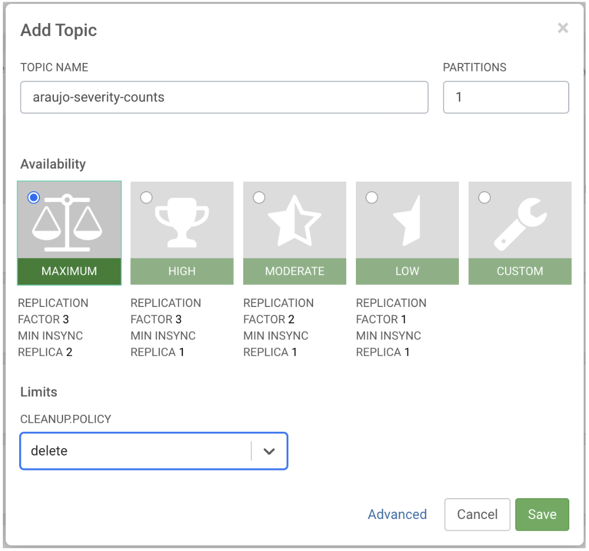</p>
 


4. Back in the SSB UI, select **job4** in the Explorer pane to open the SQL editor for it. You should see the aggregation query that you had created in the previous section.  
     
5. Before you can run this job in production you need to create a Virtual Table in SSB and map it to the **\<userid\>-severity-counts** Kafka topic that was created above.

   The structure/schema of this table must match the structure of the output of the query that is being executed. Thankfully, SSB has a template feature that makes this very easy to do.  
     
   Click on the **Templates** button above the SQL editor and select **upsert-kafka \> json**.

   <p align="center">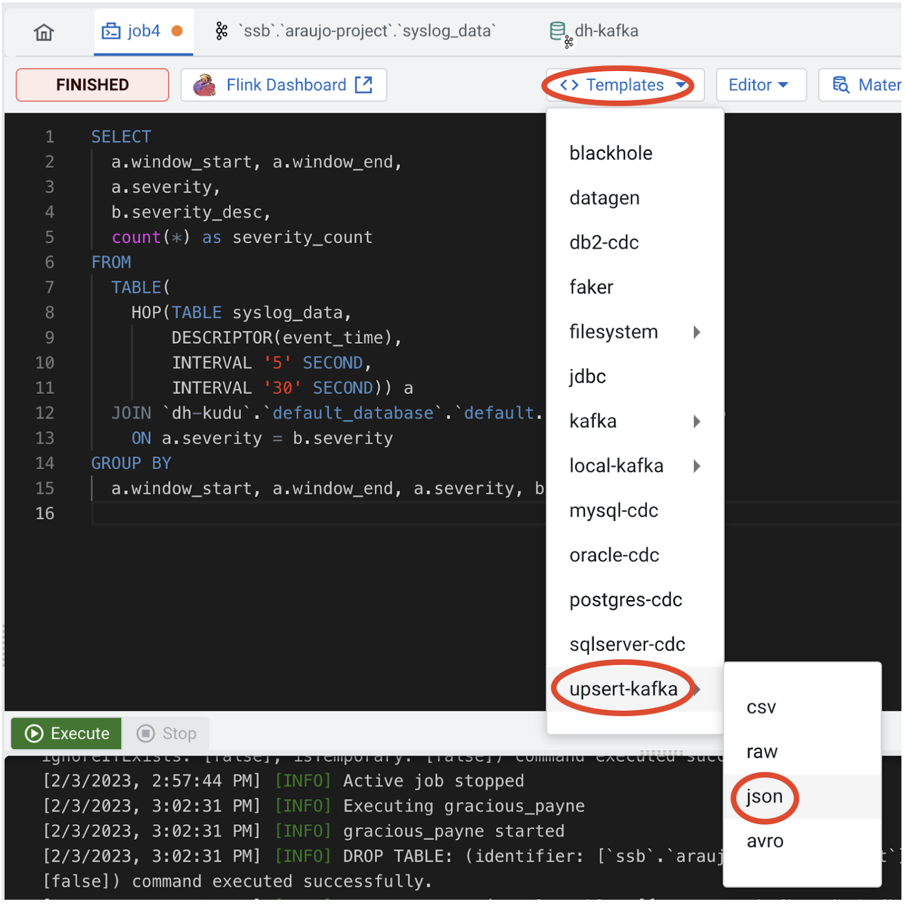</p>  
     
   You will notice that a **CREATE TABLE** template was inserted at the beginning of the editor. Scroll up and down to check the contents of the editor. **Please do NOT execute it yet**.  
     
6. The added template is a CREATE TABLE statement to create a Virtual Table of the type you selected. Before you can execute it you have to complete the template with the missing information.

   Make the following changes to the template:  
   1. Table name: change the table name to **<userid\>\_severity\_counts**  
   2. Primary key: add the following primary key clause after the last column in the table (severity\_count):  
   3. Properties: replace all the properties in the WITH clause with the following:  

      'connector' = 'upsert-kafka: <data_source_name>',
      'topic' = '<userid>-severity-counts',
      'key.format' = 'json',
      'value.format' = 'json'
   

   4. topic: **<userid\>-severity-counts**

   

   There are other optional properties commented out in the template that you can ignore. The completed template should look like the one below:

   

   <p align="center">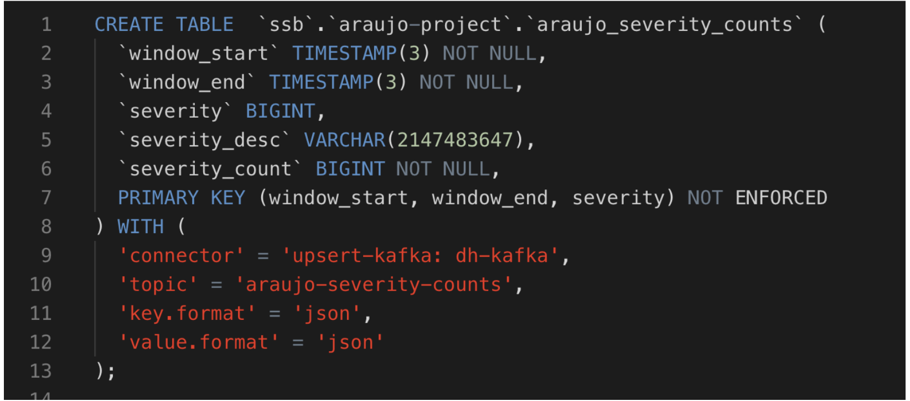</p>

7. With your mouse, select only the text of the entire CREATE TABLE statement and click on the **Execute Selection** button to run only that statement and create the Virtual Table.

   <p align="center">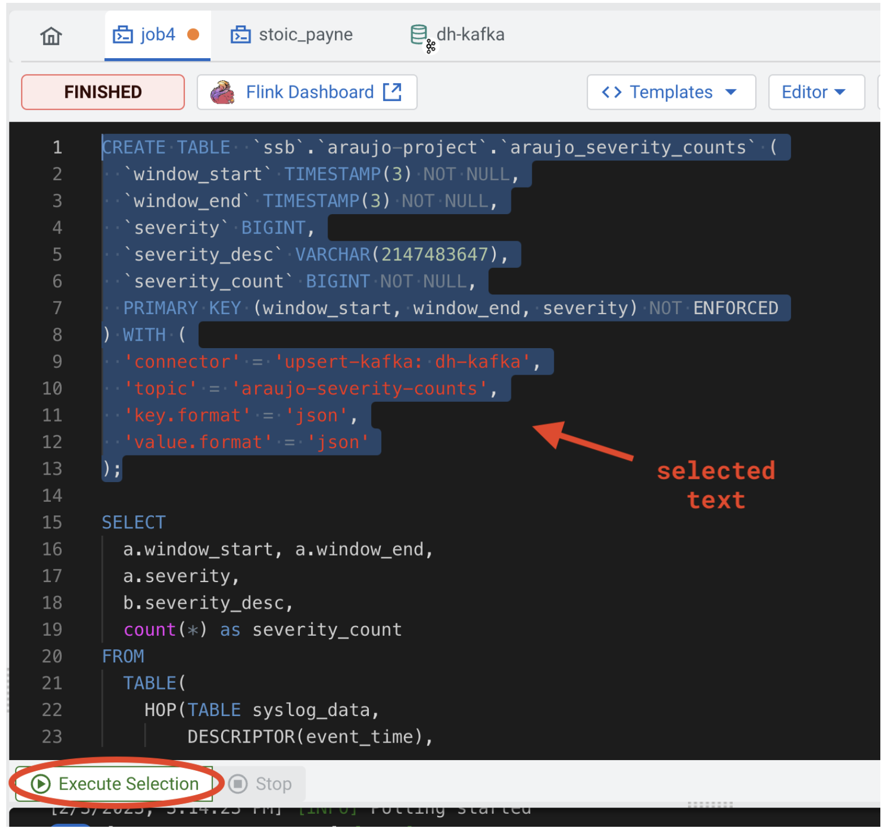</p>

   After the CREATE TABLE execution you can see the created table in the Explorer tree:

   <p align="center">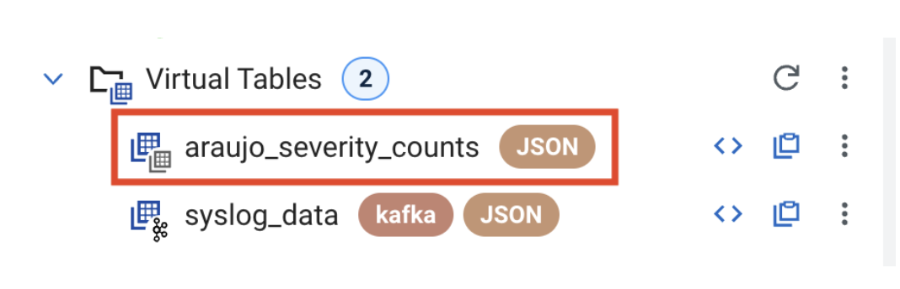</p>

8. Once the table is created successfully, delete the CREATE TABLE statement from the SQL editor.  
     
9. Modify the original query in the editor by adding the following line before the SELECT keyword:
```json
   INSERT INTO <userid>_severity_counts
```
     
   Your final statement should look like this:  
     
   <p align="center">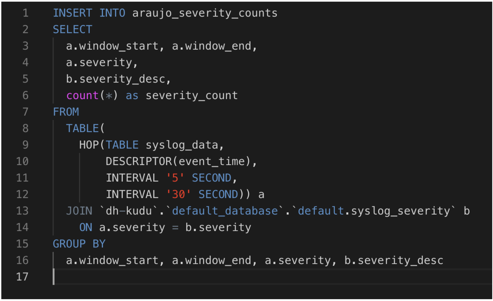</p>  
     
10. Click on the **Execute** button to submit your job for execution.  
      
11. You should see the output of the query on the Results tab once the job starts executing. You can close the tab or window at any time and the job will continue running on the Flink cluster.  
12. Open the SMM UI again, click on the **Topics icon**  and search for the **<userid\>-severity-counts** topic.  
13. Click on the Data Explorer icon () for the topic  to visualize the data in the topic. You should be able to see recently added data with the aggregations produced by **job4**:

    <p align="center">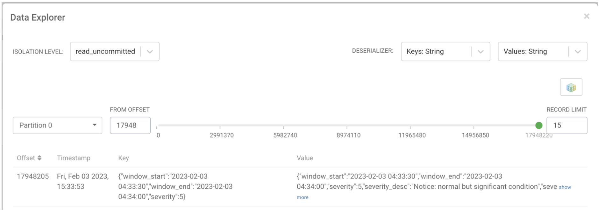</p>
   
   
   
   

## **11. Versioning your project changes into GitHub**

Now that you have completed the changes to your project, at least for now, you can commit the changes and version that into your GitHub repository.

1. Click on the Source Control icon, as shown below:

   <p align="center">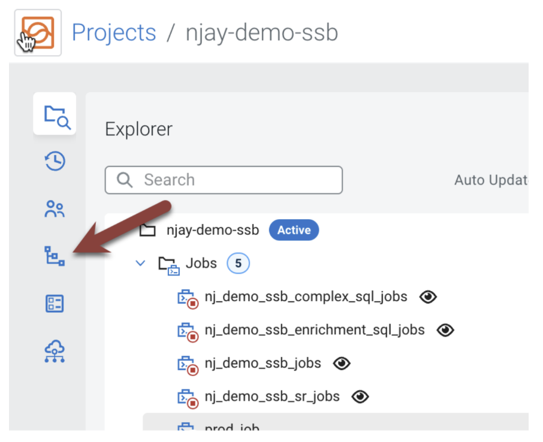</p>  
     
2. Click on the **Push** tab at the top, enter your commit message and click on the **Push** button.

   <p align="center">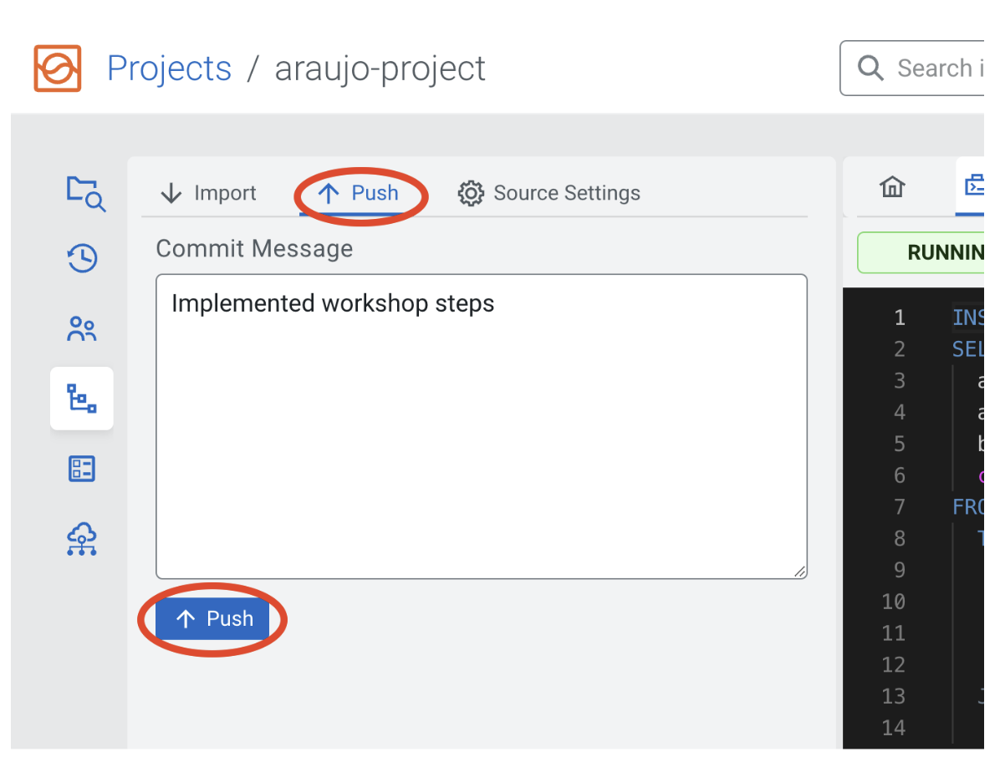</p>

   If your push is successful you should see the following message:

   

   <p align="center">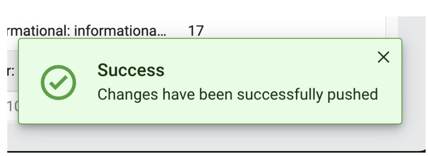</p>

3. Verify the github repository. Changes will be pushed to the remote repository.

   <p align="center">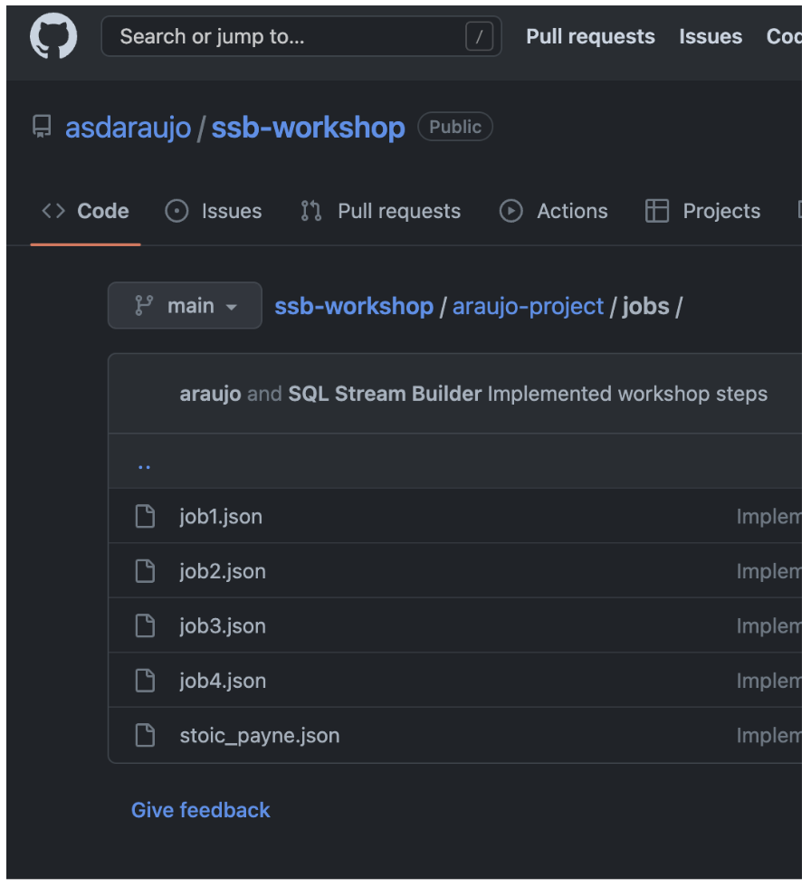</p>

## **12. Troubleshooting Flink/SSB jobs**

If you have problems with running your jobs, follow the steps below to check job details in SSB and on the Flink Dashboard.

1. Click on your job (under Jobs on the left bar) to open the job editor:

   <p align="center">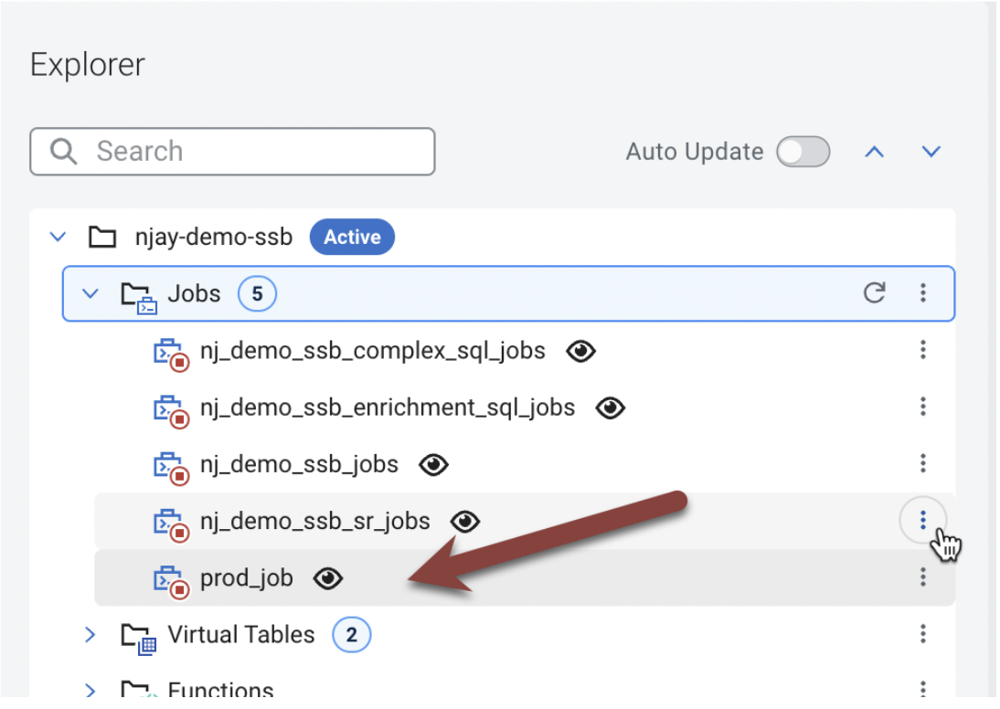</p>

2. Click on the **Flink Dashboard** link to open the Flink Dashboard for job

   <p align="center">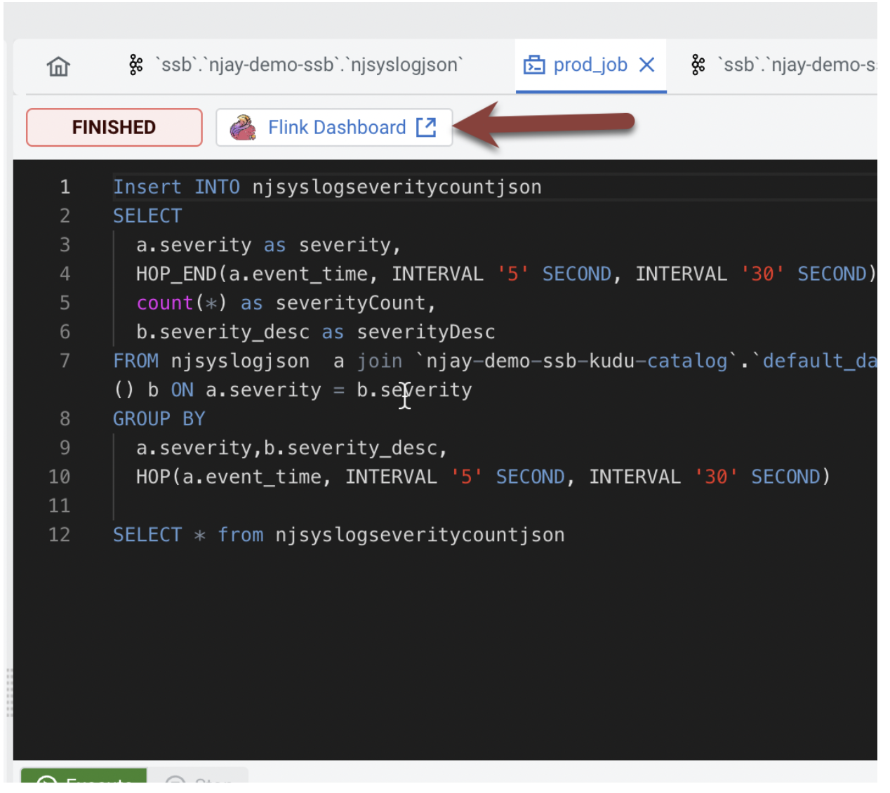</p>

3. Navigate the dashboard pages to explore details and metrics of the job execution:

   <p align="center">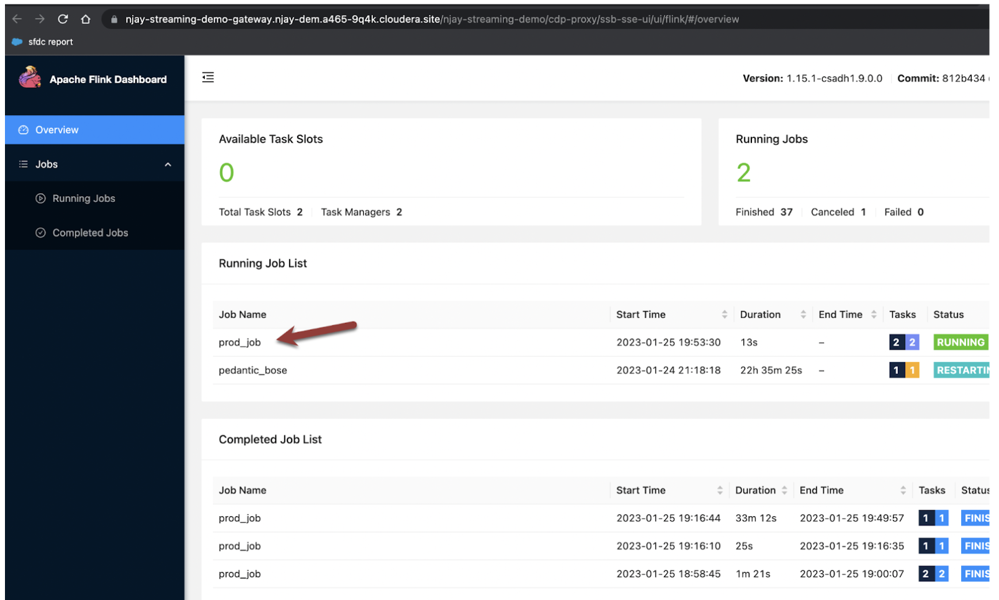</p>

4. Browse the job's DAG. Click on each of the operators (blue boxes) to see metrics and details of each one, including their individual tasks.

   <p align="center">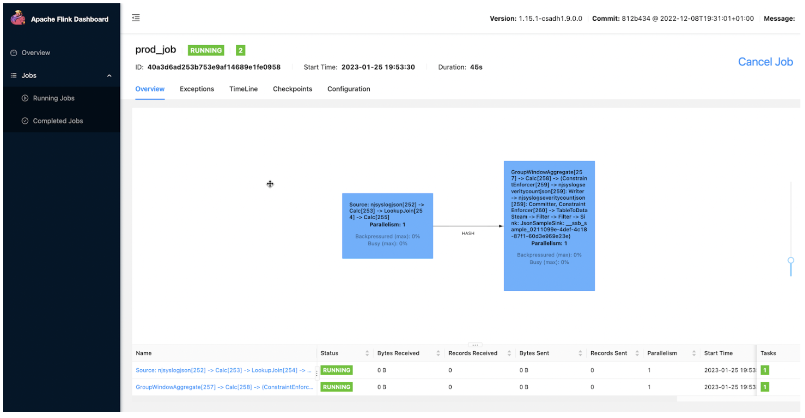</p>


## **13. Common issues**

If you run into problem, look for commons issues and solutions below:

| Issue: Job execution failed: Could not start Flink session for user: njayakumar" |
| :---- |
| **Solution:** [Give users access to your cluster](https://docs.cloudera.com/cdf-datahub/7.2.12/quick-start-sa/topics/cdf-datahub-sa-cluster-quick-start-giveaccess.html) |

