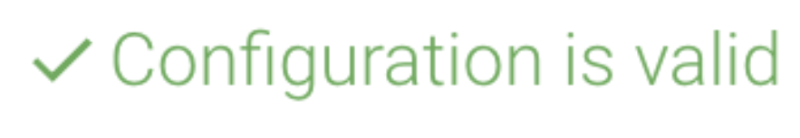
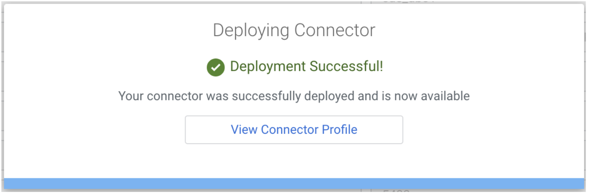
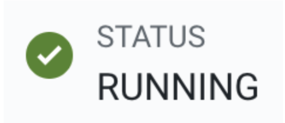
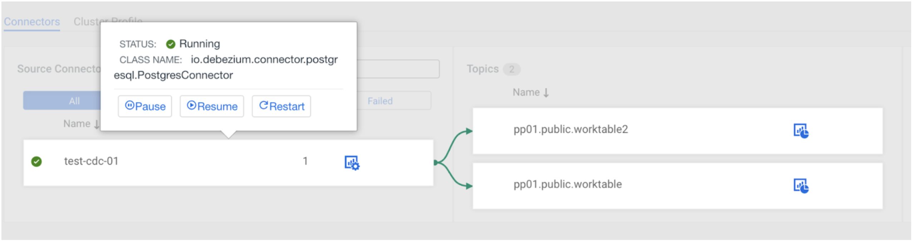

# Module 4 \- CDC with Kafka Connect 

## 1\. Overview 

Cloudera provides Kafka Connect connectors that use Debezium libraries to provide Change Data Capture (CDC) functionality. This makes it very simple to capture transactional data from the most common databases (Oracle, MySQL, PostgreSQL, DB2 and MSSQL) and process that data in a streaming fashion  in real time.

Debezium provides a unified format schema for changelog and supports serialization of messages using JSON and Apache Avro. This can be enable a number of use cases, including:

* Synchronizing incremental data from databases to other systems  
* Collecting and storing audit records from database changes

In this module you will configure and use Kafka Connect to capture changes being made to a PostgreSQL database.

## 2\. Required details

The PostgreSQL database used in the workshop is hosted in a VM created in the cloud environment. To connect to PostgreSQL you must first connect to the VM (using your web browser) and then connect to PostgreSQL using the command line tool psql.

Your workshop instructor will share the IP address and credentials to connect to the VM and to the PostgreSQL database. Before starting the workshop, ensure you have the following details for your group:

| Credential | Value |
| :--- | :--- |
| 🖥️ **VM IP Address** | `provided by instructor` (1) |
| 👤 **OS Username** | `workshop` |
| 🔑 **OS Password** | `clouderasko2024` |
| 🗄️ **DB Host IP** | `provided by instructor` (2) |
| 🧑‍💻 **DB Username** | `cdc_userXX` *(replace `XX`)* |
| 🔐 **DB Password** | `cloudera` |
| 💾 **DB Name** | `cdc_dbXX` *(replace `XX`)* |

where **XX** is a two digit number assigned to your group by the instructor (between 01 and 50, inclusive)

**Notes:**

1. Public IP of the bastion host  
2. Private IP of the bastion host

## 3\. Create a work table in the PostgreSQL database

1. Open a new browser tab and connect to **https://\<VM IP address\>/workshop/**  
2. Login with the OS credentials listed in the table above  
3. Once you are logged in, execute the following command to connect to your assigned PostgreSQL database:  
```json
      psql --host localhost --port 5432 --user <DB username> <DB name>
      Password for user <DB username>: <DB password>
```
     
   Replace the parameters in bold with the values listed in the table above.  
     
### 🐘 Quick psql Cheat Sheet

| Command | Description |
| :--- | :--- |
| `\d` | List all tables, views, and sequences. |
| `\d <table_name>` | Describe a specific table (columns, types, etc.). |
| `\q` | Exit the psql interactive terminal. |

   

4. Create a table by executing the following commands in psql:  
```json
   DROP TABLE IF EXISTS worktable;

   CREATE TABLE worktable (col1 INTEGER PRIMARY KEY, col2 TEXT);
```
     
5. Enable replication for the table so that you can capture changes made to it:  
```json
   ALTER TABLE worktable REPLICA IDENTITY FULL;
```
   

## 4\. Deploy the PostgresConnector

You will now deploy a PostgresConnector in Kafka Connect to capture changes in your assigned database.

1. In the CDP Console, find the Streams Messaging (Kafka) DataHub of your environment and click on it to open the DataHub page.  
2. Click on the 
3. icon to open the SMM UI  
4. In the SMM UI, click on the **Connect icon** () on the left-side bar to open the Kafka Connect page.  
5. Click on the **New Connector** button to add a new connector.  
6. In the **Select A Template** page, click on the Source Template **PostgresConnector**.  
7. Once the property fields for the PostgresConnector appear, enter a name for your connector in the first field at the top. Call it: **test-cdc-XX**, where **XX** is your group assigned number.  
8. Set the properties for the connector as per the table below:  
     
> ⚠️ **Deprecation Notice**
>
> The following properties are deprecated and can be ignored. They will be removed in a future release:
> * `database.history.*`
> * `Database.server.id`


| connector.class | io.debezium.connector.postgresql.PostgresConnector |
| :---- | :---- |
| **database.dbname** | \<DB name\> |
| **database.hostname** | \<DB host IP address\> |
| **database.port** | 5432 |
| **database.user** | \<DB username\> |
| **database.password** | \<DB password\> |
| **database.server.name** | pg**XX** |
| **plugin.name** | pgoutput |
| **tasks.max** | 3 |


  **Important:** The property **database.server.name** is ***not*** the hostname of the PostgreSQL server. This property is an arbitrary string that will be used to prefix the name of the topics created by this connector. The connector will create one topic per table in the specified database. The name of the topic will be **\<database.server.name\>.\<schema\>.\<table\_name\>**.


8. There are 3 additional properties needed to complete the connector configuration. Add the properties below by clicking on one the icons in the page:

   

| Property | Value |
| :--- | :--- |
| `producer.override.sasl.mechanism` | `PLAIN` |
| `producer.override.sasl.jaas.config` | `org.apache.kafka.common.security.plain.PlainLoginModule required username="<user>" password="<password>";` |
| `slot.name` | `groupXX` *(replace `XX`)* |

9. Once you have entered all the properties above, click on the **Validate** button. If the validation succeeds you will see the following message:

<p align="center"></p>  
Otherwise, fix the errors and try validating again until all the errors are fixed.

10. Click the **Next** button (at the bottom) to continue.  
11. Review the information in the Configuration Review page and if everything is correct click **Deploy** to deploy the connector. If the deployment is successful you will see the following message:  
    <p align="center"></p>  
  
12. Click on the **View Connector Profile** button to see the connector details. You should see the connector status as **RUNNING**, with a green status icon:  
    <p align="center"></p>  


## 5\. Generate database activity

1. If you are not connected to the PostgreSQL database, connect to it using psql (see steps 3.1 to 3.3 above)  
2. Execute the following commands below to generate activity on the work table
```json
   INSERT INTO worktable VALUES (1, 'ONE');

   INSERT INTO worktable VALUES (2, 'TWO');

   INSERT INTO worktable VALUES (3, 'THREE');

   UPDATE worktable SET col2 \= 'TROIS' WHERE col1 \= 3;

   DELETE FROM worktable WHERE col1 \= 2;

   SELECT \* FROM worktable;
```
## 6\. Verify results

1. In the SMM UI, click on the **Connect icon** () on the left-side bar to open the Kafka Connect page.  
2. Find your deployed connector (**test-cdc-XX**) and click on it. The UI will show arrows from the connector to the associated topic(s), similar to the picture below:  
   <p align="center"></p>  
 
3. Click on the  icon of the associated topic. The topic metrics page will open.  
4. Click on the DATA EXPLORER tab and browse through the data generated by the PostgresConnector.  
     
   Each message corresponds to one database transaction. You should be able to identify the following transactions, which correspond to the database changes performed previously. Each message is a JSON object with the following payload attributes:

| Operation | `payload.op` | `payload.before` | `payload.after` |
| :--- | :---: | :--- | :--- |
| ➕ INSERT | `c` | `null` | `{"col1":1,"col2":"ONE"}` |
| ➕ INSERT | `c` | `null` | `{"col1":2,"col2":"TWO"}` |
| ➕ INSERT | `c` | `null` | `{"col1":3,"col2":"THREE"}` |
| ✏️ UPDATE | `u` | `null` | `{"col1":3,"col2":"TROIS"}` |
| 🗑️ DELETE | `d` | `{"col1":2,"col2":null}` | `null` |
